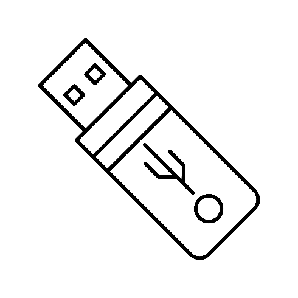
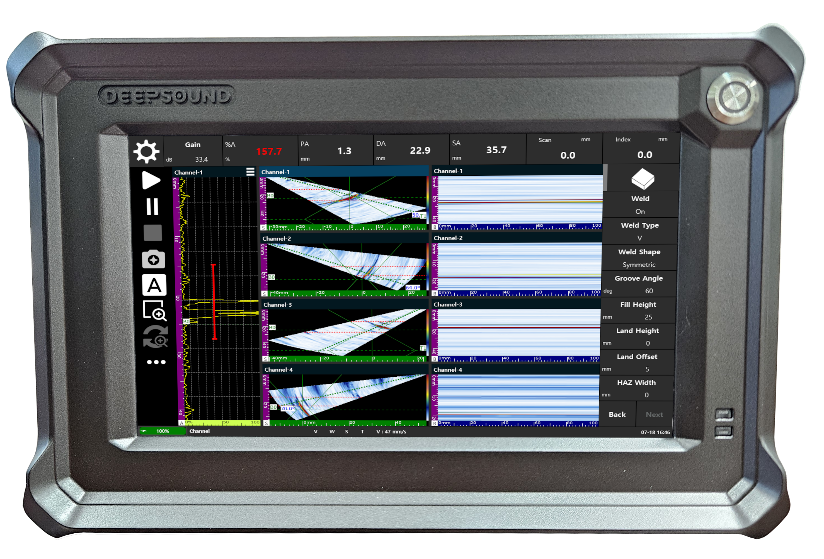

# CM5 프로그램 업데이트 방법

본 가이드는 **DEEPSOUND B3** 장비의 시스템 운영 효율성과 성능 개선을 위해 **CM5 프로그램**을 안전하게 최신 버전으로 업데이트하는 공식 절차를 안내합니다. B3 장비는 리눅스(Linux) 운영체제 기반으로 구동되므로, 가이드의 안내에 따라 차근차근 진행해 주시기 바랍니다.

---

## 1. 설치 전 준비 사항

업데이트 작업을 시작하기 전에 아래의 준비물이 모두 갖추어졌는지 확인하십시오.

* **DEEPSOUND B3 장비** (인터넷 연결 필수)
* **USB 메모리 1개** (FAT32 또는 NTFS 포맷 권장)
* **USB 허브 1개** (장비 포트 확장용)
* **키보드 및 마우스** (USB 연결형)
* **최신 CM5 설치 프로그램** (`.zip` 압축 파일)

### [준비 장비 및 환경 레퍼런스]

| [1] USB 메모리 | [2] USB 허브 |
| :---: | :---: |
|  |  |
| **[3] DEEPSOUND B3 장비** | **[4] 인터넷 연결** |
|  |  |

---

## 2. 업데이트 단계별 가이드

### 1단계: 프로그램 다운로드 및 USB 복사

1. PC를 통해 **DSPAUT 공식 홈페이지**의 **Download** 섹션에 접속합니다.
2. 최신 버전의 CM5 프로그램 압축 파일(`.zip`)을 다운로드합니다.
3. 다운로드한 파일의 압축을 푼 후, 실행 파일 및 관련 에셋 폴더를 **USB 메모리의 루트 디렉토리**에 복사합니다.
4. B3 장비 우측의 USB 포트에 **USB 허브**를 연결하고, 준비된 **USB 메모리**를 허브에 삽입합니다.

---

### 2단계: Linux 바탕화면 진입 및 환경 구성

1. 장비에 연결되어 있는 USB 허브에 **키보드와 마우스**를 연결합니다.
2. 시스템 UI 상에서 아래의 안내된 클릭 절차를 거쳐 Linux OS의 **바탕화면(Desktop)으로 진입**합니다.
   * 바탕화면 진입을 위해 시스템 트레이 또는 화면 상단의 **환경설정 아이콘**을 마우스로 클릭합니다.
   * 노출되는 설정 및 제어 장치 메뉴 중에서 **Device** 항목을 찾아 선택하고, 우측 상단의 **Minimize**(최소화) 버튼 또는 관련 숨김 탭을 클릭합니다.
   * **환경설정 목록** 창이 하단으로 정리되면서 활성화된 Linux 바탕화면 제어 화면을 확인할 수 있습니다.
3. B3 장비는 유저 편의성을 위해 키보드/마우스를 연결하여 바탕화면으로 진입할 수 있도록 설계되었습니다. 이를 통해 내부의 데이터(Data), 이미지(Image), 세팅 파일(Set) 등을 USB로 복사 및 이동하여 자유롭게 활용할 수 있습니다.

> ⚠️ **중요**  
> 업데이트 진행 중에는 반드시 장비가 **인터넷에 정상적으로 연결**되어 있어야 합니다.

---

### 3단계: 실행 중인 기존 프로그램 종료

1. 리눅스 바탕화면이 노출되면, 현재 화면에서 구동 중인 기존의 메인 프로그램 창을 확인합니다.
2. 프로그램 화면 우측 상단의 **"X" 아이콘**을 마우스로 정확히 클릭하여 현재 실행 중인 기존 소프트웨어를 완전히 종료 처리합니다.

---

### 4단계: 시스템 대시보드(Dashboard) 기동

1. 바탕화면 또는 작업 표시줄에서 **웹 브라우저 아이콘**을 마우스로 클릭하여 브라우저 창을 실행합니다.
2. 웹 브라우저 창이 발생하면, 주소창에 해당 B3 장비에 부여된 **고유 IP 주소와 포트 번호(`8810`)**를 입력하여 시스템 관리 대시보드에 접속합니다.
   * *접속 예시*: `http://192.168.0.92:8810`
   * *주의*: 장비마다 할당된 IP 주소가 다르므로, 사전에 장비 설정에서 부여된 IP 주소를 정확히 확인한 후 입력하십시오.

---

### 5단계: 업데이트 파일 선택 및 업로드

1. 시스템 대시보드 웹 페이지 상단 우측 메뉴 중에서 **Update** 링크 항목을 찾아서 클릭합니다.
2. 대시보드 Update 화면으로 이동하면, 중앙에 위치한 **Choose File** (파일 선택) 버튼을 마우스로 클릭합니다.
3. 파일 탐색기 창이 노출되면, 좌측 드라이브 메뉴에서 연결된 **USB 드라이브**를 선택하고, 사전에 복사해 둔 최신 **CM5 업데이트 프로그램 파일**을 클릭하여 선택합니다.

---

### 6단계: 업데이트 실행 및 프로세스 진행

1. 파일 선택이 정상적으로 완료되면, Choose File 옆에 업로드할 프로그램 파일명이 올바르게 표시되는지 육안으로 확인합니다.
2. 파일명이 확인되면 하단의 **Start update** 버튼을 클릭하여 업데이트 설치를 본격적으로 가동합니다.
3. 업데이트가 구동되는 동안 상태바에 `Running` 상태 메시지가 노출되며 시스템 내부 교체가 이루어집니다.
4. 설치가 성공적으로 완수되면 상태창의 문구가 **`Running ➔ Success`**로 최종 변경되면서 프로그램 업데이트가 모두 마감됩니다.

---

### 7단계: 시스템 리부팅 및 최종 버전 교차 검증

1. 프로그램 설치 성공(`Success`) 메시지를 확실히 확인한 후, **B3 장비의 메인 전원을 완전히 껐다가 다시 켜서** 하드웨어 시스템을 재부팅해 줍니다.
2. 장비 전원이 다시 인가되면, 최신 버전으로 업데이트된 CM5 프로그램이 시스템 시작과 함께 자동으로 백그라운드 구동을 시작합니다.
3. 프로그램 인터페이스가 모니터 화면에 나타나면, 아래 그림과 같이 **UI 좌측 하단의 버전 표시 영역**에 마우스를 대고 버전 정보를 확인합니다.
4. 이전 버전 정보가 신규 설치한 최신 버전 정보로 올바르게 교체되어 정상 작동하는지 최종적으로 확인하여 매뉴얼 절차를 마칩니다.

---

> 💡 **추가 팁**  
> 시스템 업데이트 후 프로그램 오작동 또는 특정 데이터 동기화 에러가 발생할 경우, 장비가 인터넷 허브에 정상적으로 링크되어 있는지 IP 구성을 재확인하시거나 ㈜성산연구소 기술 지원 포털로 문의하시기 바랍니다.
