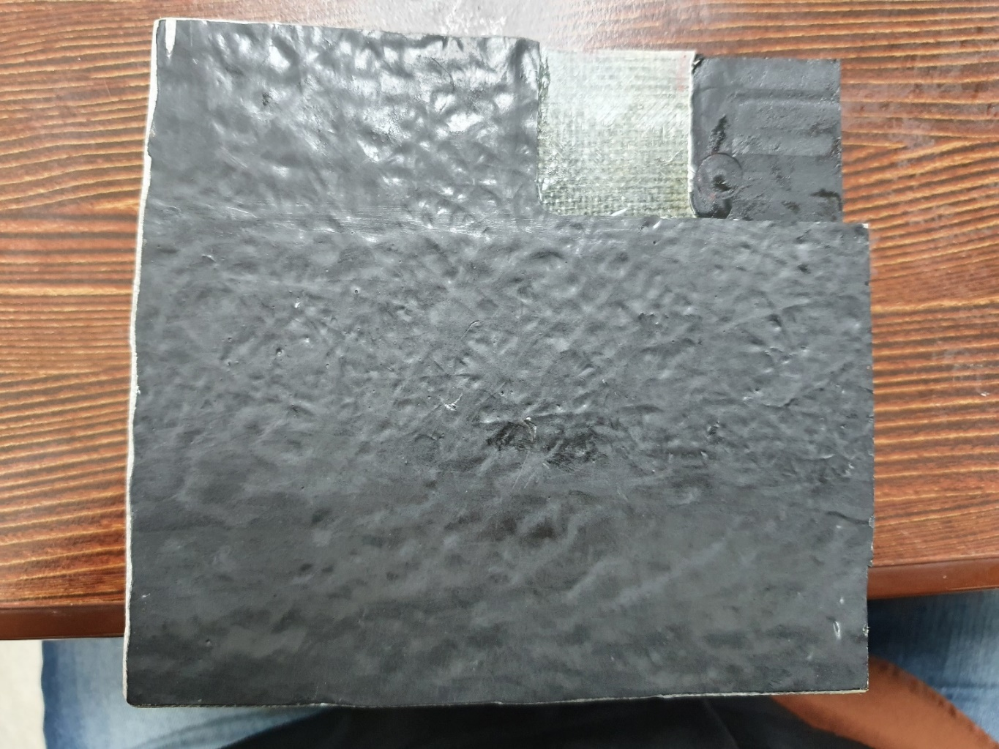
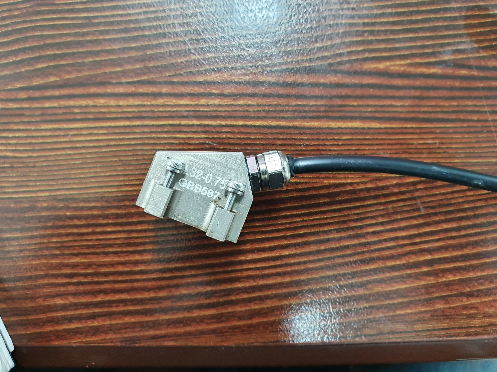
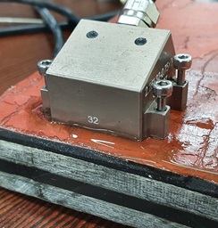

Composite materials are widely used in modern industry, but detecting internal defects is challenging due to their unique attenuation characteristics. In this post, we share the results of verifying how successfully internal potential defects can be detected in composite materials using the DEEPSOUND PAUT system.

---

## Test Samples

Front and back views of the specimen used for verification.

- **Front Side**

- **Back Side**

---

## Measuring Method

Measurements were performed by placing the probe directly on the sample without a wedge. The main goal is to confirm whether points of various sizes (Point #1 to Point #3) are clearly identified on the PAUT S-scan.

- **Equipment Used:** 2.25 MHz PAUT Probe

- **Marking of each signal point (Point #1 to #3)**

---

## Inspection Point #1

- **Point #1 Actual Thickness:** Approx. 7.00 mm
- **Detected Reflection Signal Position:** 6.13 mm
- **Observation Result:** The ultrasonic signal reflected from the middle rubber layer is clearly displayed on the S-scan.

- **Point #1 S-Scan Image**

---

## Inspection Point #2

- **Point #2 Actual Thickness:** Approx. 11.00 mm
- **Detected Reflection Signal Position:** 10.38 mm
- **Observation Result:** A clear reflection signal can be identified at the specified depth.

- **Point #2 S-Scan Image**

---

## Inspection Point #3

- **Point #3 Actual Thickness:** Approx. 23.00 mm
- **Detected Reflection Signal Position:** 22.31 mm
- **Observation Result:** The ultrasonic signal reflected from the point of maximum thickness of the middle rubber layer is clearly displayed on the S-scan.

- **Point #3 S-Scan Image**

---

## Evaluation & Conclusion

As a result of the test, we confirmed that clear reflection signals were detected at each designated inspection point within the composite material specimen.

1. **Frequency Selection:** This test used a **2.25 MHz** probe. Due to the high attenuation characteristics of the material, it is recommended to use a probe with a frequency lower than 2.25 MHz to obtain more optimized results.
2. **Addressing Signal Attenuation:** Composite materials inherently have high ultrasonic attenuation. It is advisable to perform simultaneous measurements with a defect-free reference sample for comparative analysis, and respond to weak signals by increasing the transmit voltage.
3. **Verification Complete:** Consequently, through this ultrasonic test, we were able to comprehensively verify internal structural changes in the composite material.

The DEEPSOUND system provides reliable data even in challenging media such as composite materials, helping inspectors interpret defects with spatial confidence.
