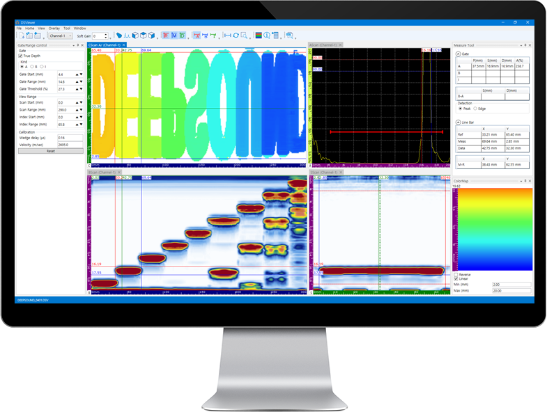
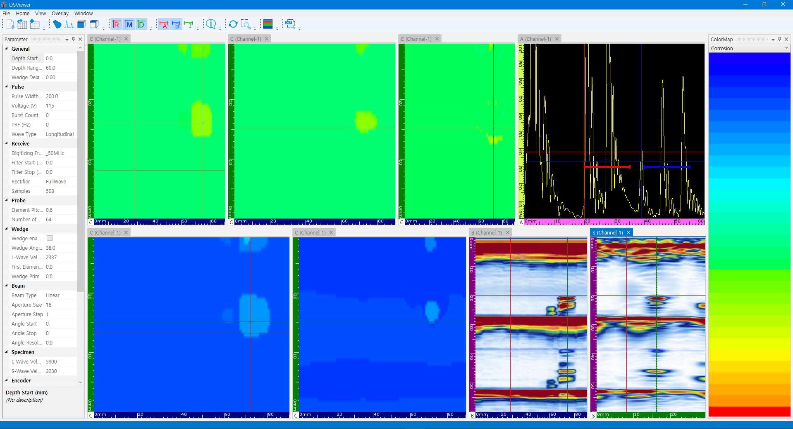
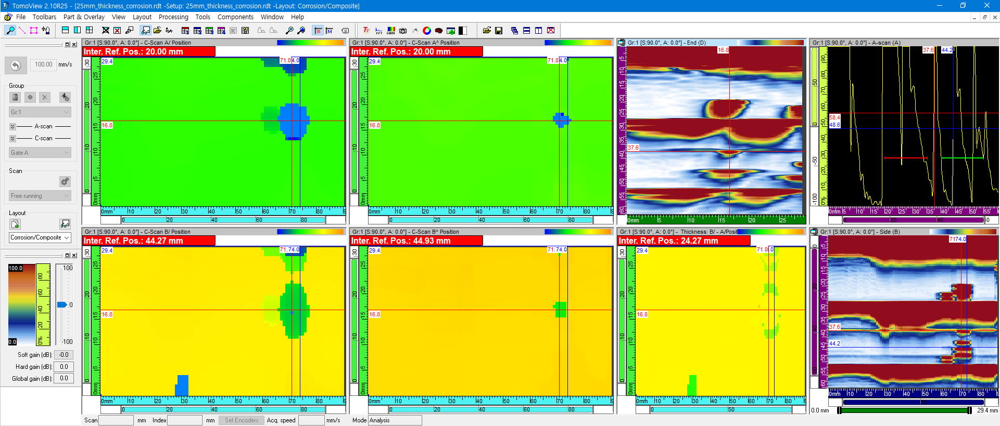
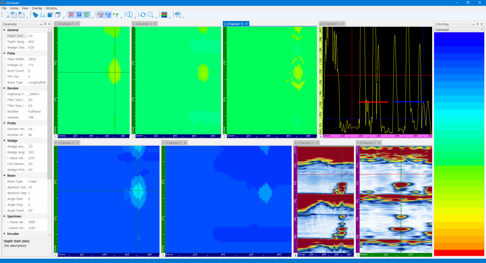
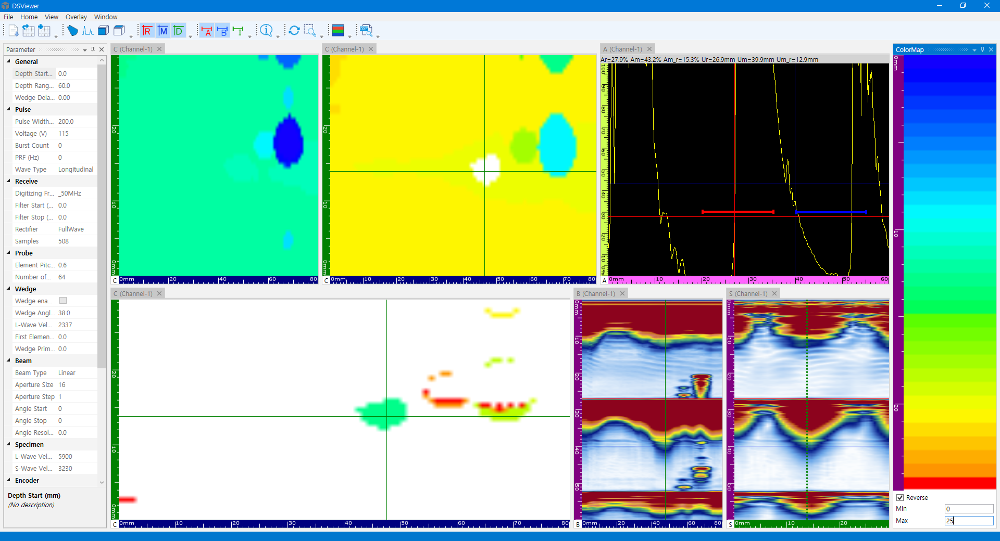

Corrosion data analysis is fundamentally about capturing minute thickness variations. In this post, we cover the results of a comprehensive comparison of Corrosion Map analysis performance between DEEPSOUND's dedicated analysis software, **DSViewer**, and third-party analysis programs.

---

## Analysis Software Overview

Colormap and interface configurations of both programs.

- **DSViewer (DEEPSOUND)**

- **Third-party Analysis Program**

---

## Data Analysis Comparison #1: Initial Defect Identification

Comparison of initial defect capturing capabilities immediately after data loading.

- **DSViewer Interface:** A-scan signals can be clearly observed and positions identified by adjusting the cursor.

- **Third-party Interface**

---

## Data Analysis Comparison #2: Signal Clarity

Comparison of defect boundary detection and signal clarity.

- **DSViewer Interface**

- **Third-party Interface**

---

## Data Analysis Comparison #3: Local Corrosion Analysis

Results of investigating local corrosion status at specific points.

- **DSViewer Analysis View**

- **Third-party Analysis View**

---

## Conclusion & Insights

1. **Color Modulation:** DSViewer provides intuitive visualization by very accurately adjusting color displays according to thickness changes.
2. **Gate Consistency:** Analysis results according to A and B gate settings are very similar to third-party systems, proving data reliability.
3. **Analysis Precision:** When comparing B-A values of specific data (Data #4), minute differences were observed between the two programs, showing that DSViewer's sensitivity processing method is very detailed.

**DSViewer** is a powerful tool optimized for precisely analyzing massive amounts of data collected in the field and generating reports from the office.
