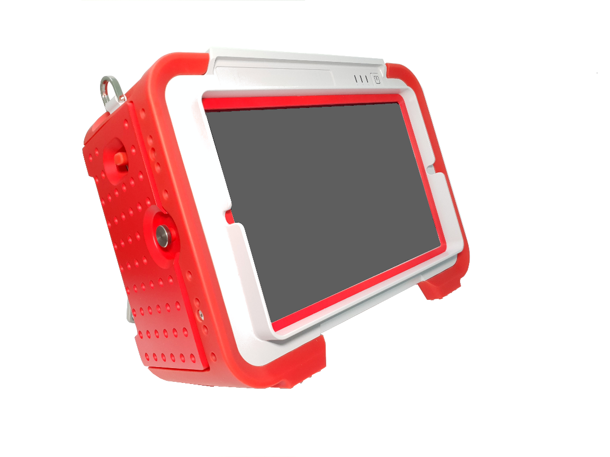
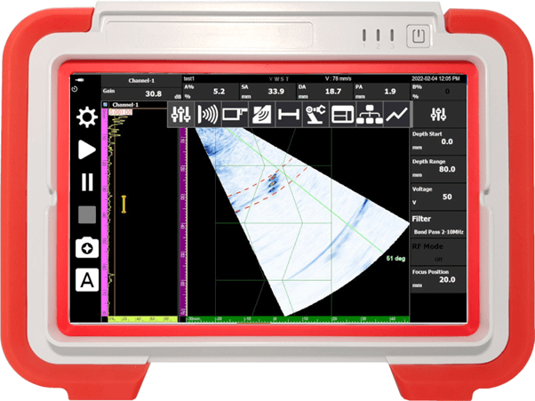
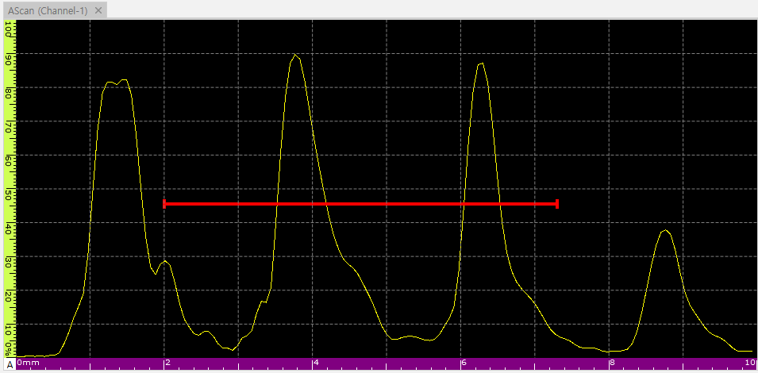
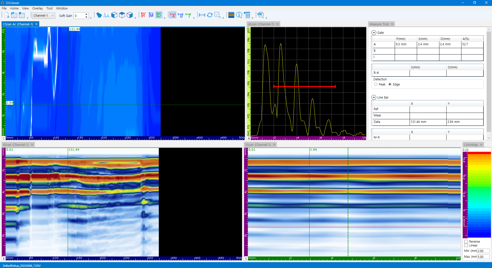

In diagnosing the safety of piping and facilities, measuring thickness reduction due to corrosion is very important. In this post, we share the entire process of accurately identifying and analyzing corrosion variations using two different samples.

---

## Test Samples

We prepared two samples with different thickness ranges.

- **Sample #1 Thickness Range:** 1.0 ~ 1.2 mm
- **Sample #2 Thickness Range:** 2.0 ~ 2.3 mm

- **Sample #1**

- **Sample #2**

---

## Equipment & Software

The inspection focused on the **DEEPSOUND P5**, a portable PAUT equipment.

- **Main Unit:** DEEPSOUND P5 (5 MHz Probe / 0-degree Wedge)

Two types of software were used for data visualization and precision analysis.
- **PAVision:** Obtains initial scan data as dedicated portable software.
- **DSViewer:** Analyzes detailed corrosion maps by loading data for precision analysis.

- **PAVision for Field Use**

- **DSViewer for Analysis Only**

---

## Methodology

Thickness variation of the material is represented by the movement of the reference point where the ultrasonic signal crosses the Measurement Gate. This allows real-time observation of changes.

---

## Sample Measurement Result Analysis

### Sample #1 (Thickness: 1.0~1.2 mm)

- **Software Interface Analysis**

- **C-Scan Color Mapping Result**

### Sample #2 (Thickness: 2.0~2.3 mm)

- **Thickness Mapping Interface**

- **Detailed Color Mapping Result**

---

## Conclusion

1. **Visual Interpretation:** Average thickness and local corrosion points can be identified immediately through the color-mapped C-Scan.
2. **Precision:** By tracking the positional movement of the ultrasonic signal in 0.01mm increments, minute thickness reductions were captured without missing anything.
3. **Efficient Analysis:** Utilizing the full interface view of DSViewer allows for a quick grasp of the corrosion status of large areas, resulting in high report generation efficiency.

**DEEPSOUND**'s solution provides top-tier corrosion diagnosis performance by connecting fast field inspection (P5/PAVision) with precise office analysis (DSViewer).
