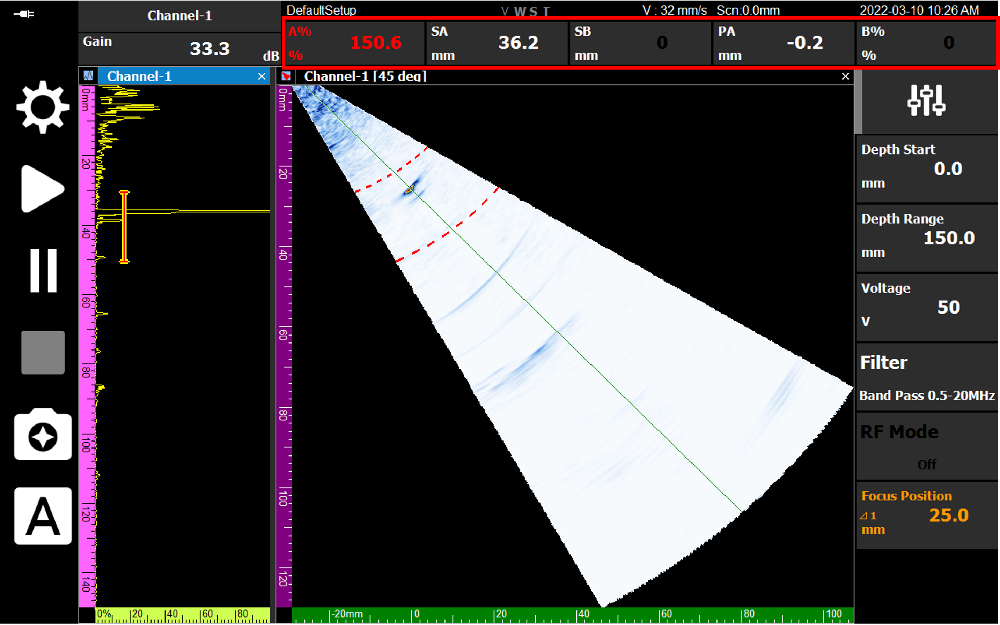
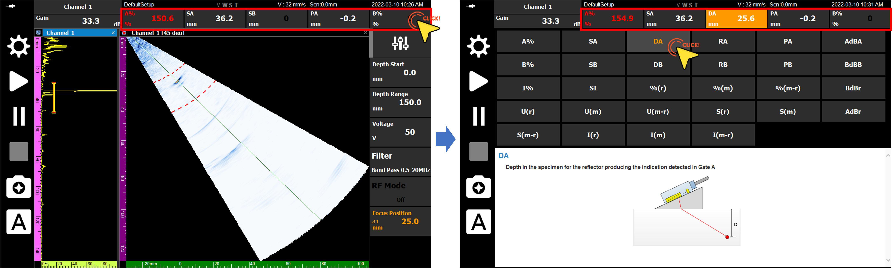
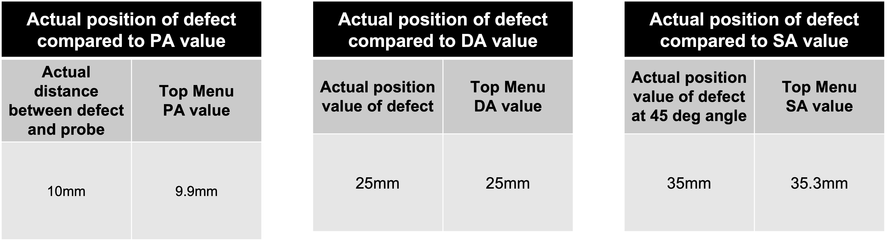

The various values displayed at the top of the screen during ultrasonic inspection are key indicators that tell the exact location of the defect. In this post, we explain the meaning of **PA, DA, and SA** data and how to verify them against actual physical distances.

---

## Definition of Measurement Data (PA / DA / SA)

Three main data points based on signals detected through the gate are displayed in the top menu of the DEEPSOUND P5.

- **PA (Projection Distance):** The horizontal projection distance from the front face of the probe to the defect.
- **DA (Depth Distance):** The vertical depth from the specimen surface to the defect.
- **SA (Surface Distance / Sound Path):** The actual sound path distance of the ultrasonic wave between the probe and the defect.

---

## How to Check Real-time Data

By long-pressing the data display area in the top menu, you can select the type of data you want to check (e.g., DA) for constant monitoring.

---

## Verification of Consistency with Physical Distance

In a calibrated system, these data points almost perfectly match the actual defect locations within the specimen.

1. **PA (Horizontal Distance):** When the front face of the probe is located directly above the defect, the PA value displays **0 mm**. As the probe moves back and forth, this value changes in real-time, indicating the horizontal position.
2. **DA (Vertical Depth):** If a defect in the test specimen is 25 mm below the surface, the DA value on the screen should also indicate **25.0 mm**. (Standard tolerance: +/- 0.5 mm)
3. **SA (Sound Path):** When detecting a defect at a depth of 25 mm at a 45-degree angle, the actual sound path according to the Pythagorean theorem is about 35 mm, which is accurately reflected in the SA value.

- **Matching check between actual depth 25mm and DA measured value 25.0mm**

- **Sound path (SA) matching the actual physical distance**

---

## Conclusion

PA, DA, and SA data are not just numbers, but a **'coordinate system'** that spatially reconstructs defects inside the specimen that the inspector cannot see with the naked eye. Accurately understanding and utilizing these figures can maximize the reliability of defect reports.

The DEEPSOUND system provides users with confident inspection results by minimizing the error between real-time values and physical positions.
