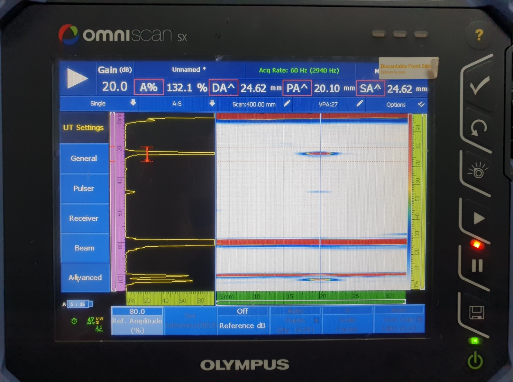

Immersion testing is highly effective for finding defects in parts requiring precision inspection by using water as a medium. In this post, we share data directly comparing the flaw detection capabilities of third-party equipment and DEEPSOUND P5 in an immersion environment.

---

## Equipment and Specifications

For an accurate comparison, the same specifications of immersion probes and wedges were used.

- **DEEPSOUND P5**

- **Third-party Comparison Equipment**

- **Probe Specification:** 5L128-I2 Model / 0.6 mm Pitch
- **Wedge Specification:** Water (Dedicated for Immersion)

---

## Flaw Detection Comparison

Flaws within the sample specimen were identified in an immersion environment, and the error range for each piece of equipment was measured.

- **Common Parameter Settings**

### Measurement Data Comparison

| Sample Flaw Location | DEEPSOUND P5 Measurement | Error Range | Third-party Equipment Measurement | Error Range |
| :------------------- | :----------------------- | :---------- | :-------------------------------- | :---------- |
| **25.00 mm (SA)**    | 25.60 mm (SA)            | **+0.60 mm**| 24.62 mm (SA)                     | **-0.38 mm**|

- **DEEPSOUND P5 Analysis View**

- **Third-party Equipment Analysis View**

---

## Conclusion

1. **Performance Equivalence:** In terms of flaw location evaluation, DEEPSOUND P5 and the third-party equipment showed very similar performance, with the error range also being at practically the same level.
2. **Signal Integrity:** Both devices showed almost the same A-scan signal pattern, confirming that data reliability and reproducibility were secured.
3. **Efficiency:** DEEPSOUND P5 proved capable of fast and accurate data collection even in environments requiring precise settings like the immersion method.

The DEEPSOUND system ensures top inspection quality by providing precise data that meets global standards across various inspection environments (immersion, contact, etc.).
