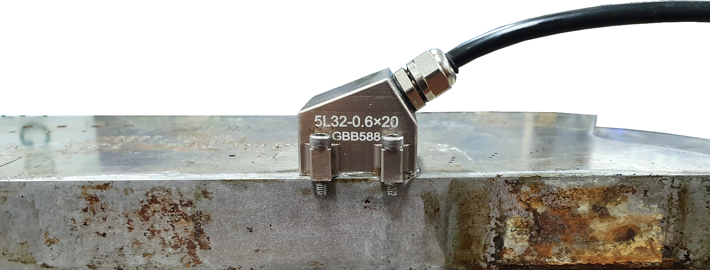
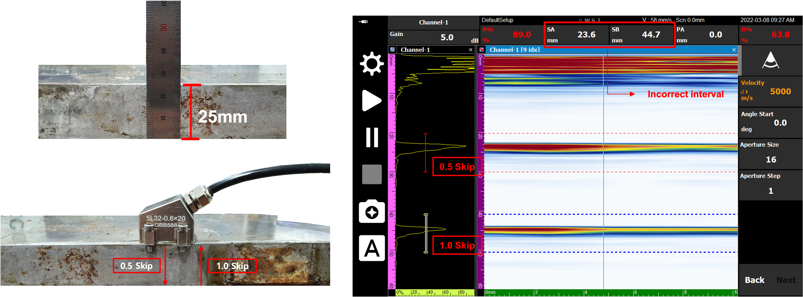
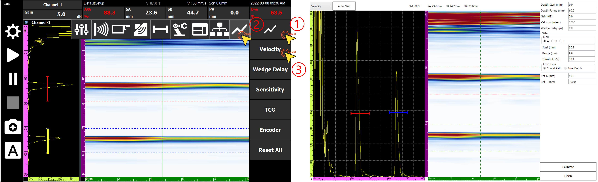
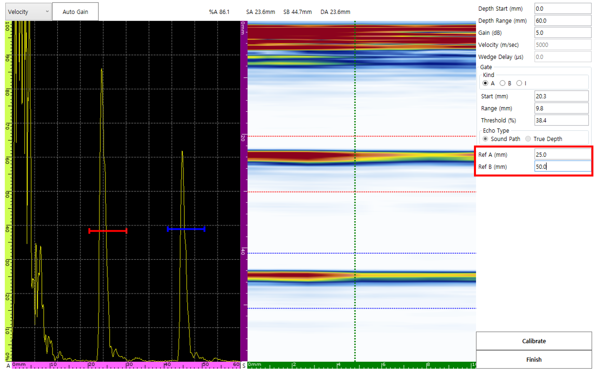
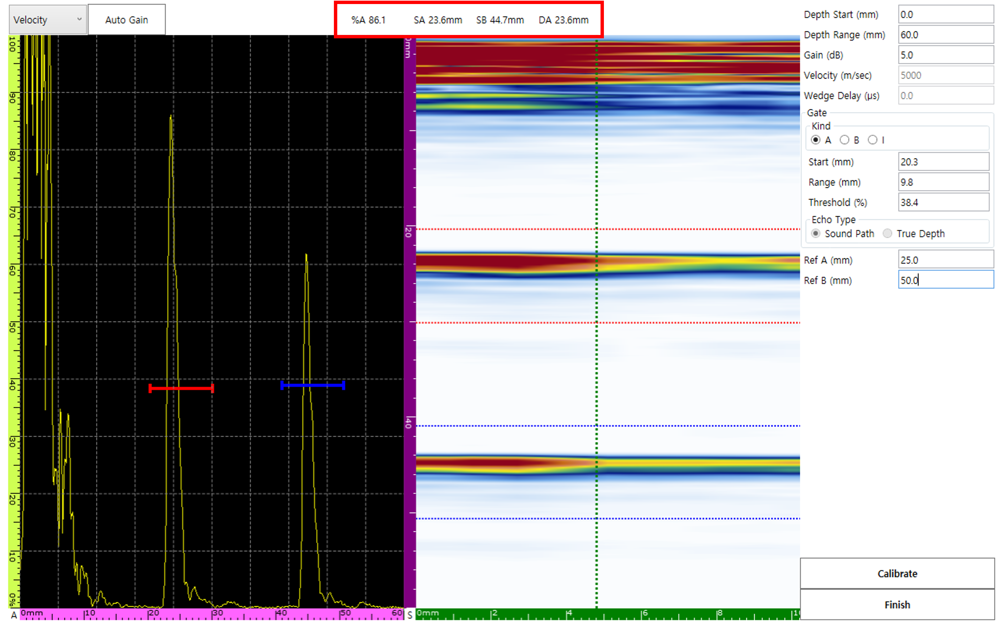
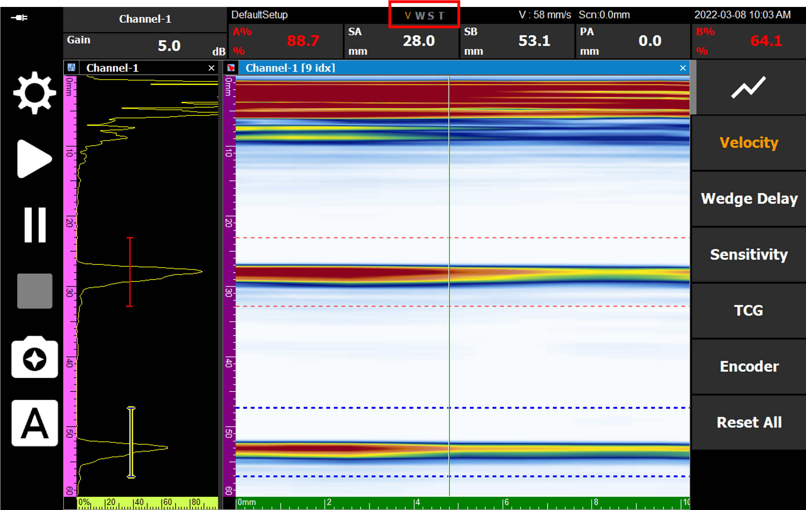

If defect locations appear inaccurate during Linear Scan inspection, you should verify whether the material velocity has been properly calibrated. In this post, we explain in detail how to calibrate linear velocity using **0.5 Skip** and **1.0 Skip** signals.

---

## Preparation

Since velocity varies depending on the temperature and composition of the medium, you must prepare a **calibration block made of the same material as the inspection target**.

---

## Phenomena Caused by Velocity Mismatch

If the velocity set in the equipment differs from the actual material velocity, the signal interval at skip locations will appear different from the actual physical distance as shown below.

- **Reference:** 0.5 Skip (25 mm) / 1.0 Skip (50 mm)
- **Correct Interval:** 25 mm

---

## Calibration Process

### 1. Entering the Calibration Page
Navigate to the dedicated **Velocity Calibration** page according to the setup sequence in the menu.

### 2. Setting Parameters and Reference Values
After adjusting Depth Range, Gain, etc., for precise signal capture, input the actual physical position values **Ref A (25 mm)** and **Ref B (50 mm)**.

### 3. Gate Alignment and Data Verification
Position the A gate and B gate at the 0.5 Skip and 1.0 Skip signals, respectively. At this time, the detected position values (SA, SB) are displayed on the screen in real-time.

### 4. Updating Velocity (Calibrate)
Click the **Calibrate** button, and the software will immediately update the material velocity based on the input reference values. After the update, SA and SB values will be aligned exactly 25 mm apart.

---

## Completion and Saving

When all processes are finished, press **Finish** to save the settings. The **'V'** among the status display labels at the bottom of the screen will be activated in orange, indicating that calibration has been successfully completed.

Accurate linear velocity calibration ensures the accuracy of linear scan imaging and significantly reduces the risk of misjudging defect locations in complex weld inspections.
