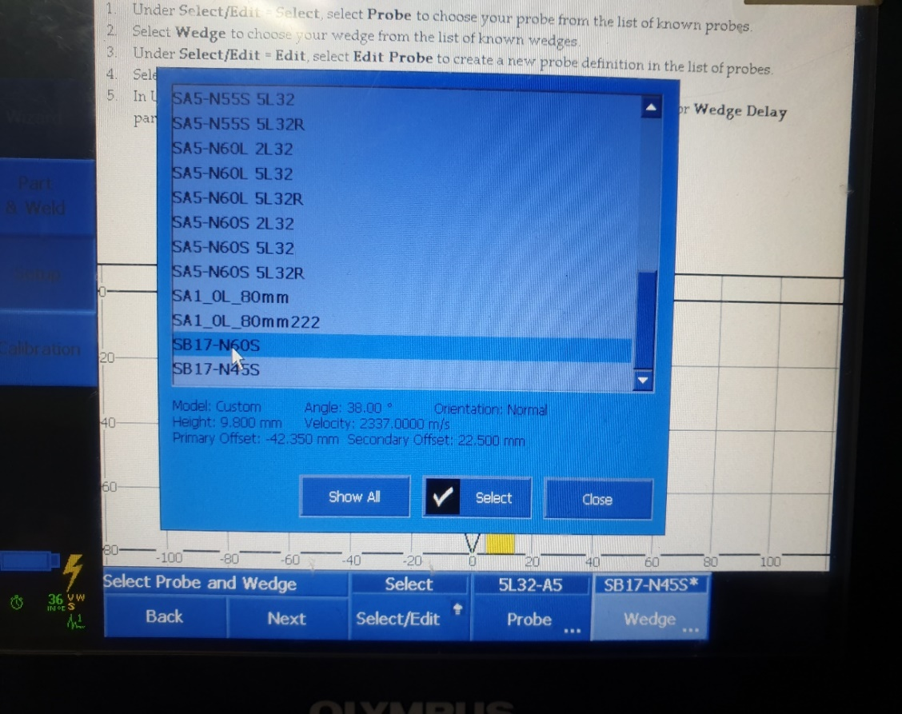
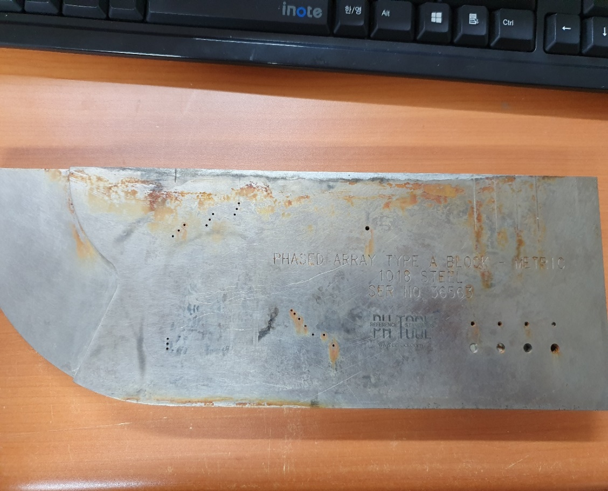
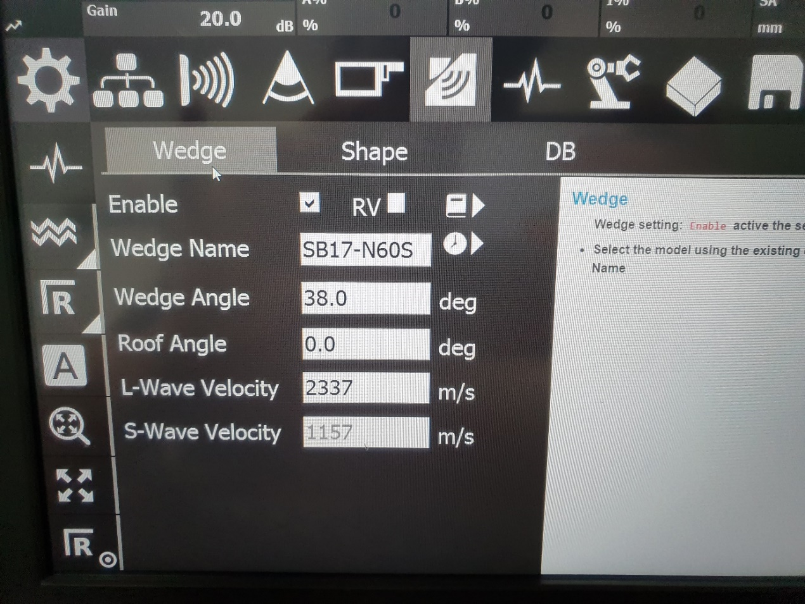
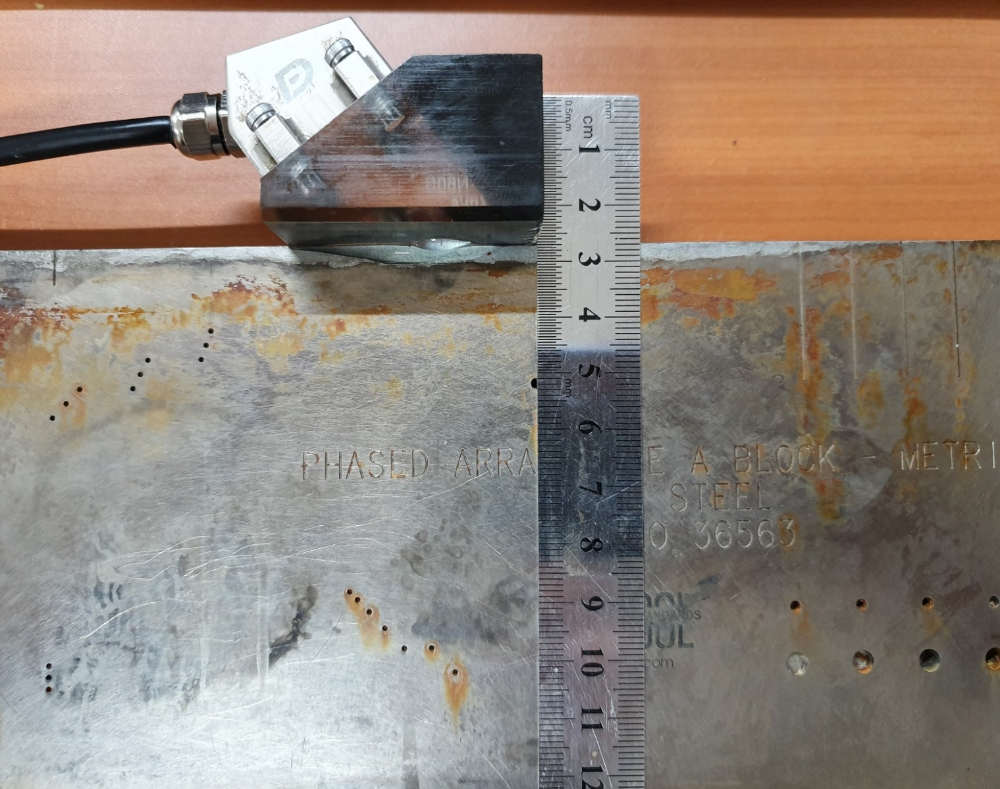
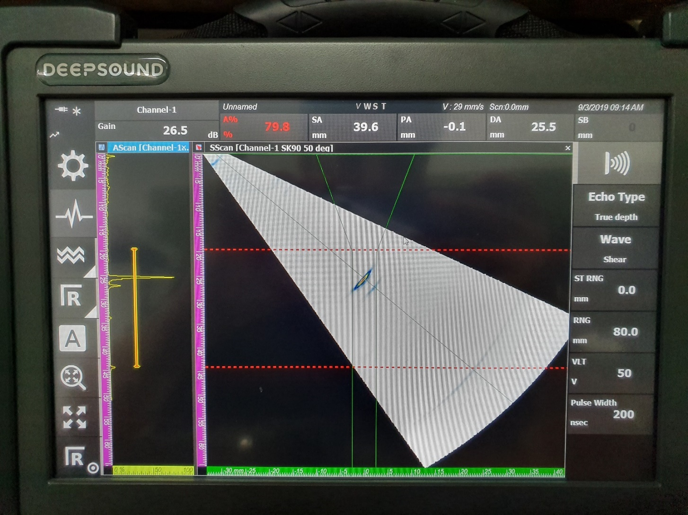
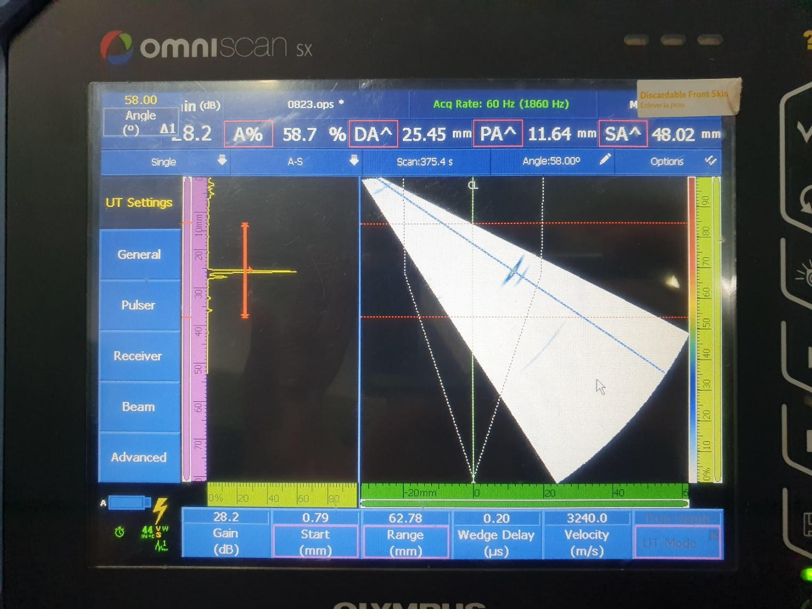

This is a comparison test to verify the defect location accuracy and the impact of calibration between third-party equipment and DEEPSOUND P5.

---

## Test Setup

The probe and wedge configurations of the two systems are as follows.

*Third-party Equipment Probe Specifications*

*Third-party Equipment Wedge Specifications*

*Test Specimen*

*P5 Equipment Probe Specifications*

*P5 Equipment Wedge Specifications*

*P5 Equipment Scan Configuration Settings*

---

## PA & DA Comparison: Defect Identification

The parameters and defect measurement criteria for third-party equipment and DEEPSOUND P5 were set and verified as follows.

---

## Image Results

A direct visual comparison of S-scan images acquired from both devices.

---

## Detailed Evaluation

Additional comparison of detected signal quality and positional accuracy.

---

## Comparative Data Verification

Analysis of the difference between locations detected by the two systems.

---

## Conclusion

As a result of the comparative analysis, we confirmed that applying **Wedge delay calibration** causes differences in PA and DA readings on both devices.

Even though wedge delay was activated and applied to both systems, minute differences remained from the actual physical location of the defects.

Overall, the detection capability and accuracy for precisely locating defects were proven to be **very equivalent between DEEPSOUND P5 and third-party equipment**.
