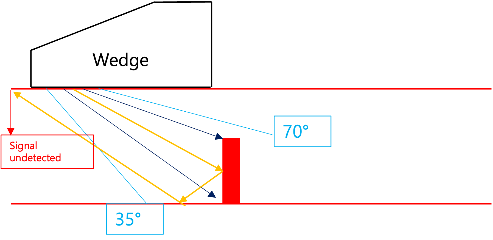

# PAUT Defect Identification Results

## Test Specimen and Procedure

- **Test Specimen Data**

1. **Software:** DSVision
2. **Equipment:** DEEPSOUND R3
3. **Probe:** 5L32-0.6
4. **Wedge:** SB17-N60S

- **Software Settings**

1. **Range:** 50 mm
2. **Voltage:** 100 V
3. **Beam Type:** Sectorial
4. **Digital Frequency:** 25 MHz
5. **Beam Angle:** 35 ~ 70 degrees
6. **Number of Elements:** 16
7. **TX (Transmit):** 16 / **RX (Receive):** 16
8. **Focus Position:** 6 mm
9. **Filter:** 3 MHz ~ 7 MHz
10. **Gain:** 40 dB

---

## Locating Defect in Specimen

- Accurately find the position of the defect by moving the wedge position while referring to the S-scan image.

- **Checking Defect Location**

- **Defect image located directly in front of the wedge**

---

## Interpreting Image Data

- **S-Scan Inspection of Defect**

- **Diagram of UT signal propagating through the specimen**

| Detected Top Part Depth (mm) | Detected Bottom Part Depth (mm) |
| :--------------------------- | :------------------------------ |
| 7.26                         | 15.03                           |

- **1.** Since the thickness of the test piece and the exact height of the defect are known, it is possible to accurately determine from which part of the defect the reflected signal originates.
- **2.** Since the surface area of the top part of the defect is relatively small, the receive Gain must be increased to clearly observe the signal. Conversely, the bottom part has a larger surface area, so reflected signals are identified immediately.

---

## Shapes of Defects

- **Drill hole defect lacking distinct reflectors**

- **Defect with distinct reflectors**

- **Corresponding S-Scan image of defect with reflectors**

- **1.** It is inherently difficult to accurately capture images of smooth defects lacking distinct reflectors, such as the drill hole mentioned above. This is because the probe cannot effectively detect ultrasonic waves that bounce uniformly off smooth surfaces.
- **2.** Conversely, if the surface of the defect is uneven or has distinct reflectors, ultrasonic waves are scattered in multiple directions. Some of these scattered waves inevitably return to the receiver, allowing the shape of the defect to be clearly represented in the S-scan image.

---

## Conclusion

- **Artificial specimen defect difficult to identify**

- **Naturally formed defect easy to identify**

- **1.** Artificial defects precisely machined into test specimens can be particularly difficult to detect and image due to their smooth geometric structure. However, naturally occurring defects tend to have very irregular and multi-directional shapes, inherently returning stronger and more consistent reflected signals to the probe. Therefore, these naturally occurring defects appear with much more accurate and defined shapes within S-scan images.
- **2.** Since Ultrasonic Testing (UT) relies entirely on processing reflected acoustic signals into graphical data, any difficulty encountered in identifying the specific shape of a defect is almost always determined by the physical geometry and orientation of the defect itself.
