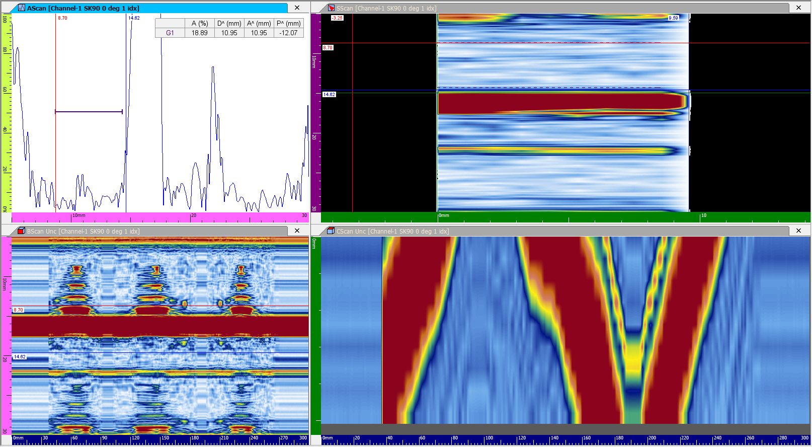

In non-destructive testing, the precision of equipment directly leads to the reliability of data. In this post, we share the results of a comparative analysis of how accurately third-party equipment and the DEEPSOUND system capture defect shapes using a test block containing defects of various sizes.

---

## Test Sample Overview

Measurements were performed using a test block with holes of various sizes.

---

## Probe & Wedge Specifications

For an accurate comparison, probes and wedges under the same conditions were used.

- **Probe Specification:** 10 MHz / 16 El / 0.6 mm Pitch
- **Wedge Specification:** 38-degree angle / 2337 m/s velocity / 15 mm height
- **Note:** Optimized the first element offset according to each manufacturer's unique standards.

---

## Sectorial Scan Comparison

Visual comparison of S-scan defect measurement images generated by third-party equipment and DEEPSOUND equipment.

- **Sectorial Scan Parameter Settings**

- **S-scan Image Comparison (Top: DEEPSOUND / Bottom: Third-party)**

### Precision Analysis Results

- **DEEPSOUND S-scan Data**

- **Third-party S-scan Data**

---

## Linear Scan Comparison

Linear scans were performed in parallel to more clearly visualize the cross-section of the sample.

- **Linear Scan Parameter Settings**

- **Linear Scan Image Comparison**

### Precision Analysis Results

- **DEEPSOUND Linear Data**

- **Third-party Linear Data**

---

## Conclusion

1. **Data Consistency:** Both DEEPSOUND and third-party equipment produced very similar and consistent defect images under the same settings.
2. **Shape Identification:** S-scan images showed a characteristic of primarily highlighting the top edge of the defect.
3. **Efficiency:** Linear scan images proved more effective for clearly visualizing the widest cross-section of the sample.

The DEEPSOUND system provides data quality equivalent to or exceeding global standard equipment and, in particular, speeds up field analysis through an intuitive interface.
