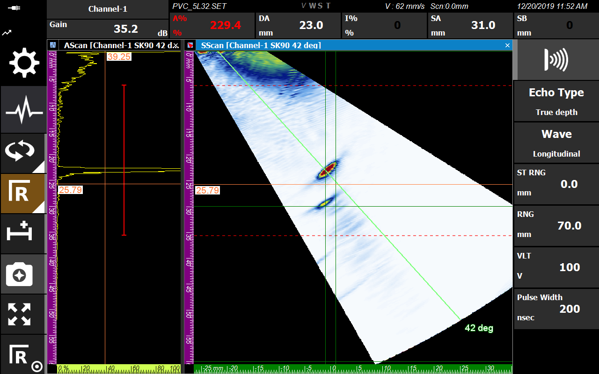

Phased Array Ultrasonic Testing (PAUT) and Time of Flight Diffraction (TOFD) are two of the most powerful techniques in modern non-destructive testing. In this post, we share the results of verifying how accurately flaws within PVC specimens can be identified using the DEEPSOUND R3 system.

---

## Test Piece and Environment

The main purpose of this verification is to confirm how precisely DEEPSOUND R3 measures specific flaw locations (Points #1, #2, #3).

*PVC Test Specimen Top Surface*

- **Material:** Rectangular PVC
- **Thickness:** 29.75 mm
- **Flaw Location (from top):** 9.00 mm / 15.00 mm / 22.50 mm

### Test Equipment Configuration
1. **Main Unit:** DEEPSOUND R3
2. **Probe:** 2.25~5L32 - N45~60S
3. **Scanner:** Scanner including dedicated encoder

*DEEPSOUND R3 Equipment and Scan Setup*

---

## Defect Measurements

Compare the actual depth values of each flaw with the data values (DA) captured in real-time by the R3 equipment.

### Flaw #1 Measurement (Actual 9.0 mm)
Flaw #1 was clearly detected at a depth of **8.7 mm (DA)** as a result of R3 equipment measurement. It shows a very low error range of only **0.3 mm** compared to the actual location.

*Flaw #1: Measured Depth 8.7 mm (Actual 9.0 mm)*

### Flaw #2 Measurement (Actual 15.0 mm)
For flaw #2, the measurement was **15.9 mm (DA)** compared to the actual location of 15.0 mm, proving very stable performance.

*Flaw #2: Measured Depth 15.9 mm (Actual 15.0 mm)*

### Flaw #3 Measurement (Actual 22.5 mm)
Flaw #3, located at the deepest point, was also accurately captured at **23.0 mm (DA)**.

*Flaw #3: Measured Depth 23.0 mm (Actual 22.5 mm)*

---

## TOFD Precision Inspection Analysis

The DEEPSOUND system also fully supports high-precision flaw detection using the TOFD (Time of Flight Diffraction) method.

*High-resolution black-and-white diffraction data using the TOFD method*

*Scanner layout structure equipped with dedicated transmit/receive sensors*

- **Advantages of TOFD:** Extremely precise measurement of exact flaw length and vertical depth is possible, and data processing speed is very fast.
- **Application Scope:** TOFD is primarily used for thin pipes (less than 5mm), and for thick pipes, it is used in parallel with PAUT for synergistic effects.

---

## Conclusion

Through this verification, the DEEPSOUND R3 system successfully proved **high accuracy within 1mm**.

### Final Measurement Data Summary

| Flaw Number | Actual Depth (mm) | Measured Depth (DA, mm) | Error (mm) |
| :--- | :--- | :--- | :--- |
| **Flaw #1** | 9.00 | 8.70 | **0.30** |
| **Flaw #2** | 15.00 | 15.90 | **0.90** |
| **Flaw #3** | 22.50 | 23.00 | **0.50** |

While Ultrasonic Testing (UT) difficulty varies depending on the geometric structure and orientation of the flaw itself, DEEPSOUND R3 provides precise data that buyers can trust across all areas through the combination of PAUT and TOFD.
