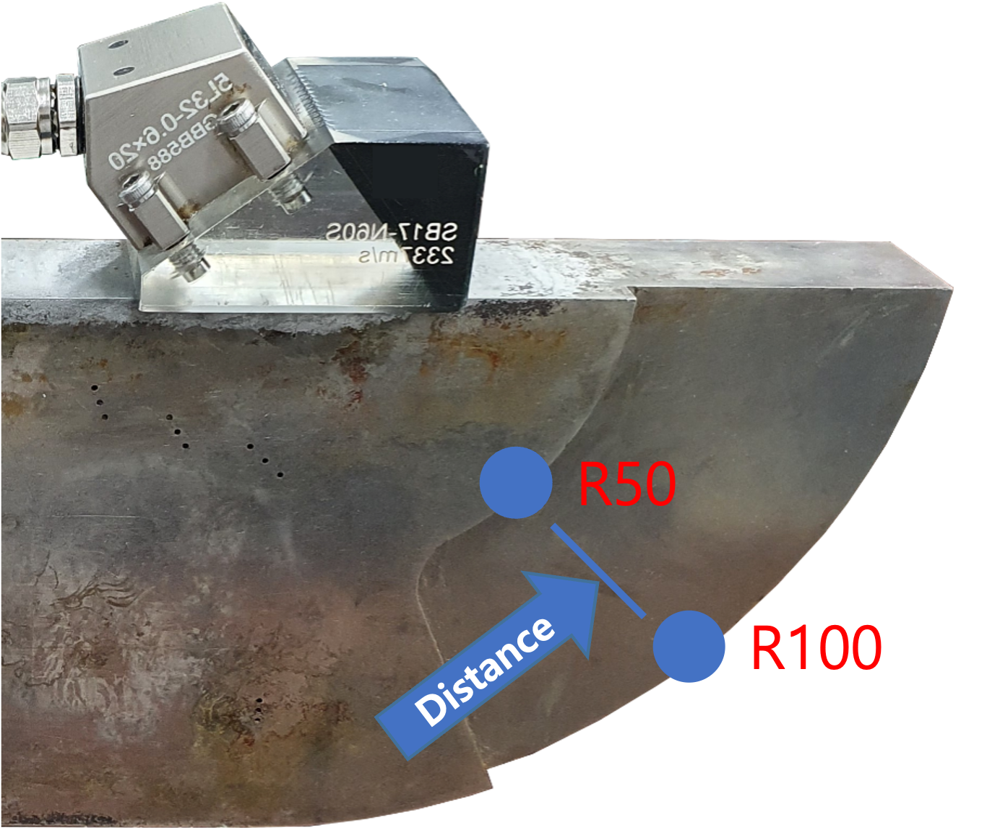
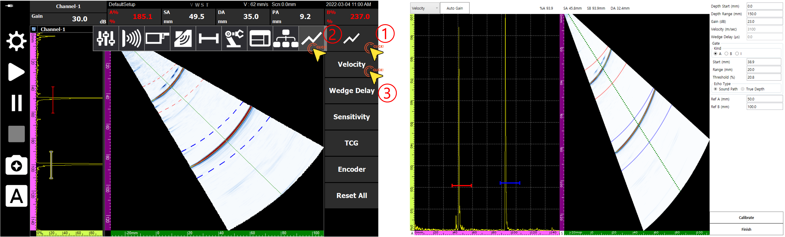
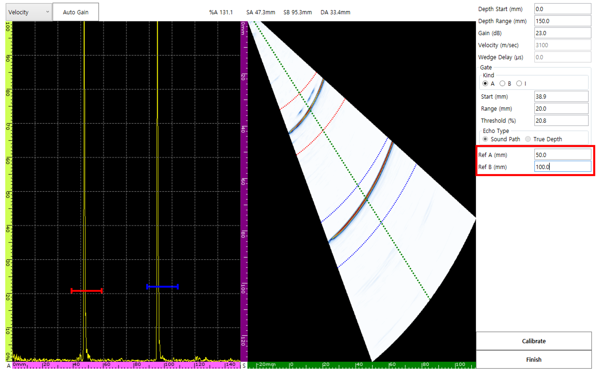
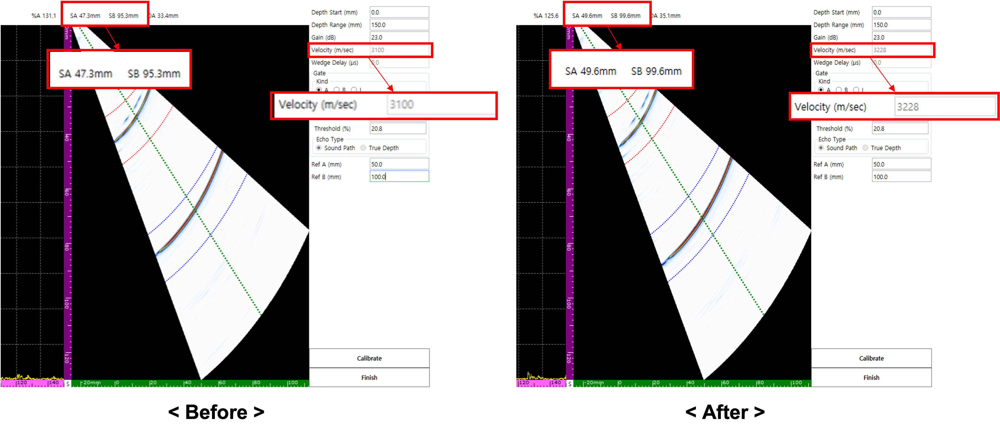
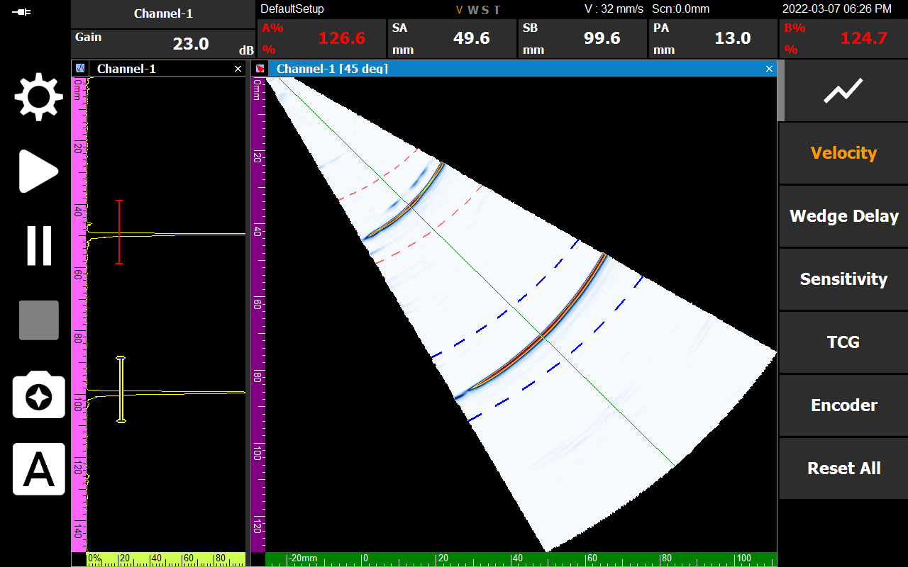

The most fundamental step in ultrasonic testing is **accurately setting the velocity for each material**. If the velocity is incorrect, all distance data on the screen will be distorted. In this post, we will look at the **Radial Velocity Calibration** method utilizing R50 (50mm) and R100 (100mm) radii.

---

## Preparation

- Calibration specimen of the same material as the target specimen to be inspected (e.g., V1 or V2 block)
- DEEPSOUND P5 equipment and appropriate probe/wedge combination

---

## Why is Velocity Calibration Necessary?

If the equipment is not set to the actual material velocity, the interval between the R50 and R100 signals appearing on the screen will be displayed differently from the actual physical distance of 50mm. This causes errors in all defect location measurements.

---

## Step-by-Step Calibration Procedure

### 1. Entering the Velocity Calibration Page
Navigate to the **Velocity Calibration** page according to the numerical order in the menu.

### 2. Setting Reference Values
To utilize the physical standards R50 and R100, set **Ref A to 50 mm** and **Ref B to 100 mm**, respectively.

### 3. Gate Alignment and Signal Capture
Move the A and B gates to the R50 and R100 signal positions, respectively. At this time, the actual measured values (SA, SB) passing through each gate are displayed on the screen in real-time.

### 4. Executing Automatic Calibration (Calibrate)
Pressing the **Calibrate** button causes the software to analyze the interval between SA and SB and automatically update the internal velocity value. Now, the interval between the two signals on the screen is adjusted to an exact 50 mm.

---

## Completion Verification

After all processes are finished and you press **Finish**, the **'V'** among the status display labels at the bottom of the equipment will be activated in orange. This means the system is perfectly synchronized with the velocity of that material.

Accurate velocity calibration is the start of reliable non-destructive testing. Secure accuracy easily and quickly in the field through DEEPSOUND P5's intuitive calibration process.
