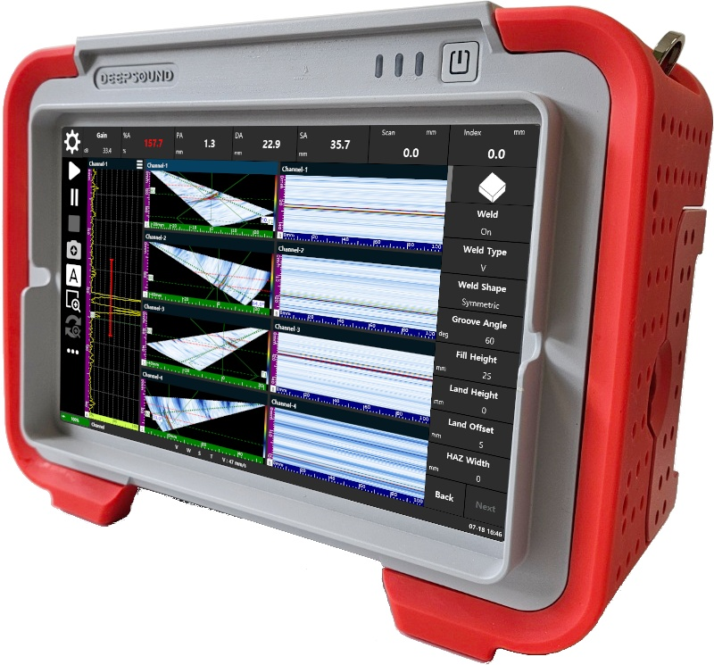
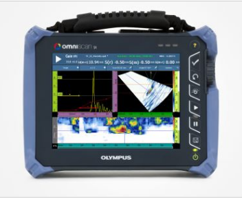
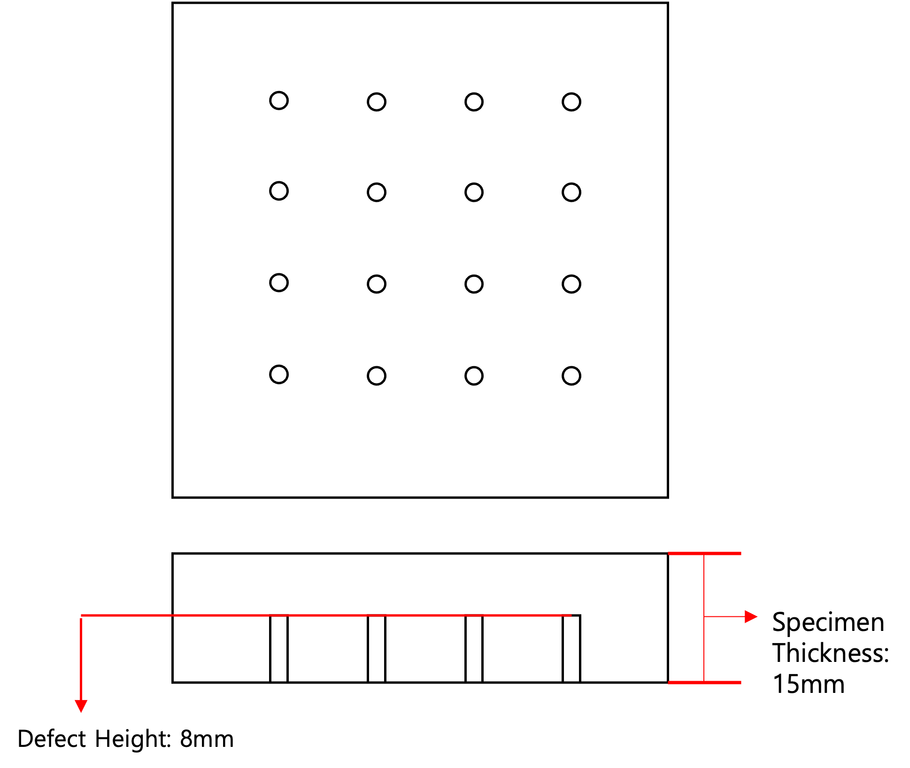
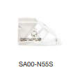

In railway inspection, even minute cracks or flaws can lead to major accidents, requiring a very high level of precision and rapid interpretation capability. In this post, we share the results of a comparative evaluation of the actual performance of third-party equipment and DEEPSOUND P5 using a specific railway rail specimen.

---

## Equipment and Configuration

- **Product Name:** DEEPSOUND P5 (12.1-inch large screen touch system)

- **Product Name:** Third-party comparison equipment

### Inspection Specifications
- **Probe:** 10 MHz band (Refer to detailed images)
- **Wedge:** SA1-N55S (Wedge for 55-degree steel)

---

## Test Specimen and Methodology

Flaw locations were analyzed using a test specimen similar to the internal structure of railway rails.

---

## Analysis Results #1: Linear Scan (Without Wedge)

As a result of performing a linear scan by placing the probe directly without a wedge, the difference in Depth Axis (DA) values was within 1mm, showing very equivalent accuracy.

| Flaw Number | DEEPSOUND P5 DA (mm) | Third-party Equipment DA (mm) | Difference (mm) |
| :---: | :--- | :--- | :--- |
| **#1** | 16.30 | 16.30 | **0.00** |
| **#2** | 20.30 | 20.87 | **0.57** |
| **#3** | 10.80 | 11.04 | **0.24** |

---

## Analysis Results #2: Sectorial Scan (With Wedge)

Results of performing a sectorial scan (35~70 degrees) with a wedge installed, similar to the actual railway inspection environment.

| Flaw Number | DEEPSOUND P5 DA (mm) | Third-party Equipment DA (mm) | Difference (mm) |
| :---: | :--- | :--- | :--- |
| **#1** | 15.60 | 15.89 | **0.29** |
| **#2** | 19.30 | 19.64 | **0.34** |
| **#3** | 10.81 | 11.01 | **0.20** |

---

## Final Comparison Results Summary

| Category | DEEPSOUND P5 | Third-party Equipment |
| :--- | :--- | :--- |
| **Image Clarity** | **Very Excellent** (Accessibility and ease of interpretation) | Low (Limitations for accurate inspection) |
| **Flaw Shape Interpretation** | **Distinct Boundaries** (Easy size measurement) | Blurry (Complex precision measurement) |
| **Program Speed** | **Fast (Less than 1 second)** | Slow (2-5 second delay) |

### Conclusion

Through this railway verification test, **DEEPSOUND P5** proved to ensure much more precise and efficient flaw detection than global standard alternative products by combining fast response speed and clear image quality. In particular, it provides clear visual evidence even within complex railway structures, dramatically increasing the reliability of inspections.
