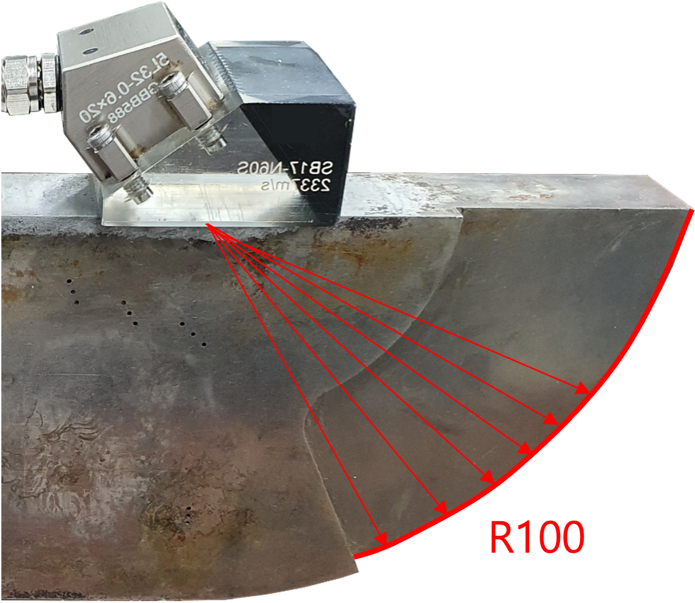
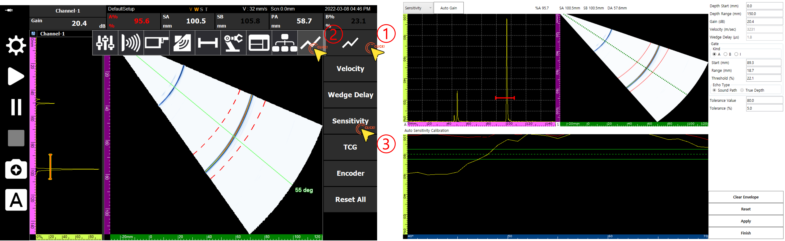
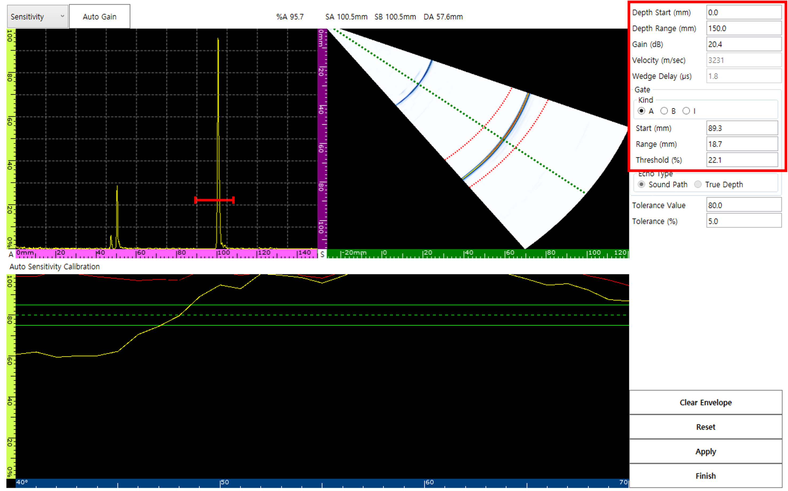
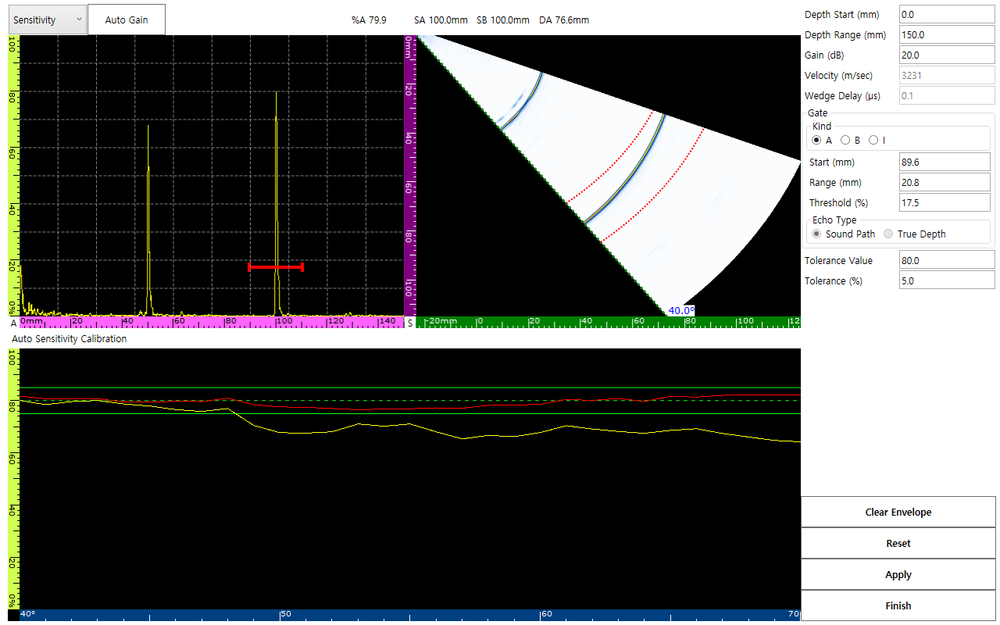

In ultrasonic non-destructive testing, if sensitivity is not properly calibrated, signal strength may appear differently depending on the location, even for flaws of the same size. This leads to misjudging the severity of the flaw. In this post, we introduce a systematic sensitivity calibration method using DEEPSOUND P5.

---

## Importance of Sensitivity Calibration

In an uncalibrated state, the amplitude values obtained from different locations on a reference specimen (e.g., R100) are not constant. Since signal amplitude is directly linked to the perceived size of the flaw, accurate calibration is essential.

---

## Calibration Procedure

### 1. Entering the Sensitivity Calibration Page
Navigate to the dedicated Sensitivity Calibration page according to the menu order.

### 2. Parameter Settings
The calibration page provides various inputs for precise adjustment, such as Depth Range, Gain, and Gate.

### 3. Signal Data Classification
The automatic sensitivity calibration window clearly distinguishes data visually.
- **Envelope:** The maximum signal trajectory occurring during the scan
- **Peak Signal:** The currently detected maximum signal
- **Reference & Tolerance:** Target amplitude values

---

## Practical Tips

It is standard to set the amplitude tolerance for the entire vector range to **80%**.

1. **Sweep:** Slowly move the probe over the calibration block to form an envelope before capturing the final data.
2. **Reset Function:** If data is inaccurate, you can restart at any time via **Reset** and **Clear Envelope**.
3. **Apply:** Ensure that tolerance values are applied uniformly across all active vectors.

- **Verifying amplitude consistency at 40-degree and 55-degree angles**

---

## Conclusion

When calibration is successfully completed, the **'S'** among the status labels at the bottom of the screen will be activated in orange.

Precise sensitivity calibration ensures the integrity of the data provided by DEEPSOUND P5 and serves as the basis for the inspector to quantitatively and accurately judge the size of flaws.
