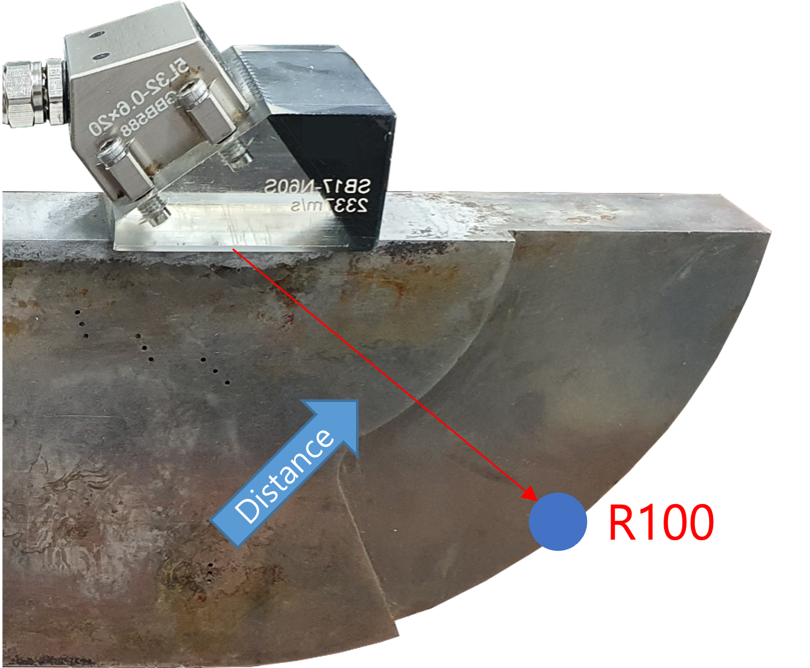
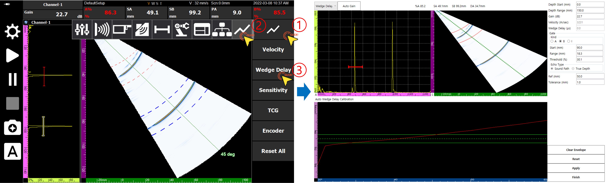
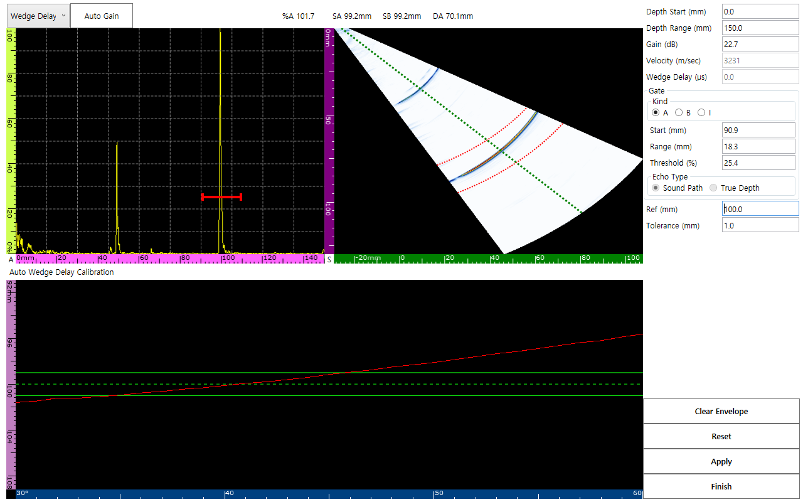
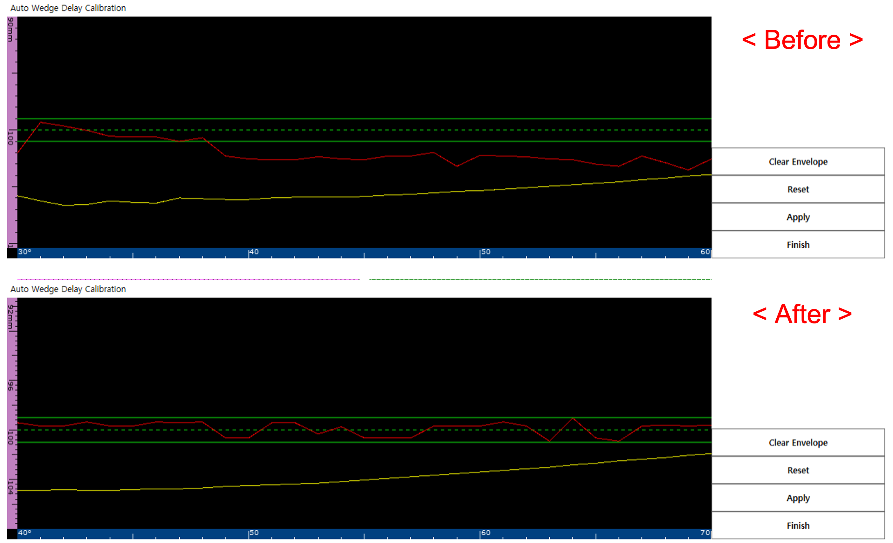
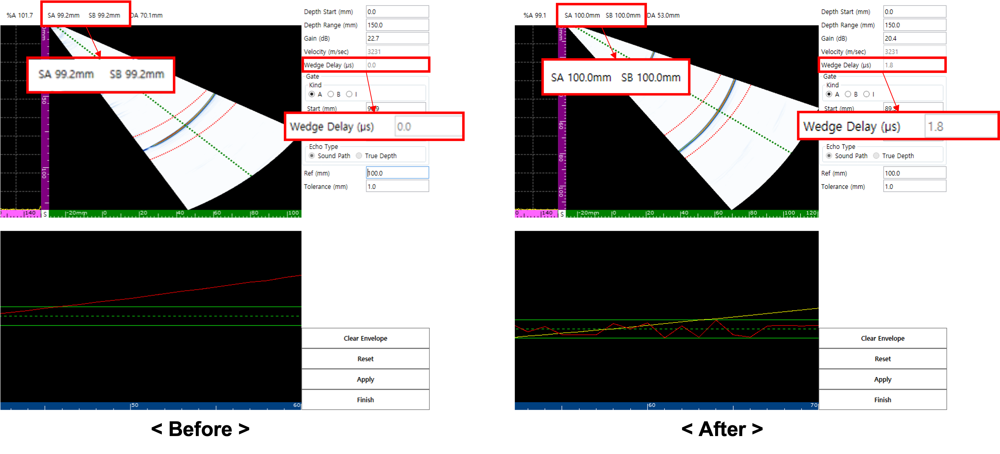

The process of compensating for the time it takes for ultrasound to pass through the 'Wedge' from the probe to the actual specimen is very important. If this process is omitted, the coordinates of all defects will appear displaced from their actual positions. In this post, we cover DEEPSOUND P5's **Automatic Wedge Delay Calibration** method in detail.

---

## Mandatory Prerequisite: Velocity Calibration

Before performing wedge delay calibration, **Velocity Calibration** must be completed. This is because calculated wedge delay values are inherently linked to velocity figures.

---

## Why is Wedge Delay Calibration Necessary?

If wedge delay is not calibrated, the system misinterprets the location of defects. For example, an error occurs where a defect at the actual R100 (100 mm) location is read as 99.1 mm.

---

## Automatic Calibration Process

### 1. Entering the Calibration Page
Navigate to the **Wedge Delay Calibration** page according to the menu guide.

### 2. Setting Reference Values and Gates
Based on the physical location of the reference specimen (e.g., R100), set the **Ref value to 100 mm**. Simultaneously, move the A gate to ensure a generous scanning window (e.g., 90–110 mm) for capturing signals.

### 3. Capturing Peak Signal (Sweep)
Manually move the probe slightly to find the point where the echo is at its maximum. At this time, the envelope signal on the screen must be accurately registered within the reference range.

### 4. Applying Calibration (Apply)
Click the **Apply** button, and the internal wedge delay value will be updated immediately. Now, check if the SA value displayed on the screen indicates an exact 100 mm.

---

## Completion and Status Verification

After completing all processes and pressing **Finish**, the **'W'** among the V, W, S, and T labels at the bottom of the equipment will be activated in orange. This systematically shows that wedge delay calibration has been successfully completed.

Wedge delay calibration is like the **'zero-point adjustment'** of defect detection. Maximize the precision of field inspections in just a few minutes by utilizing DEEPSOUND P5's automatic calibration function.
