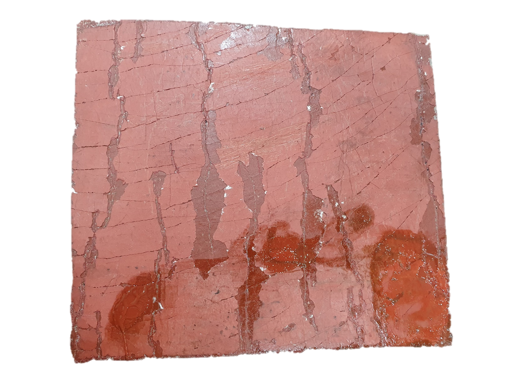
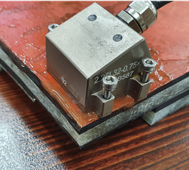
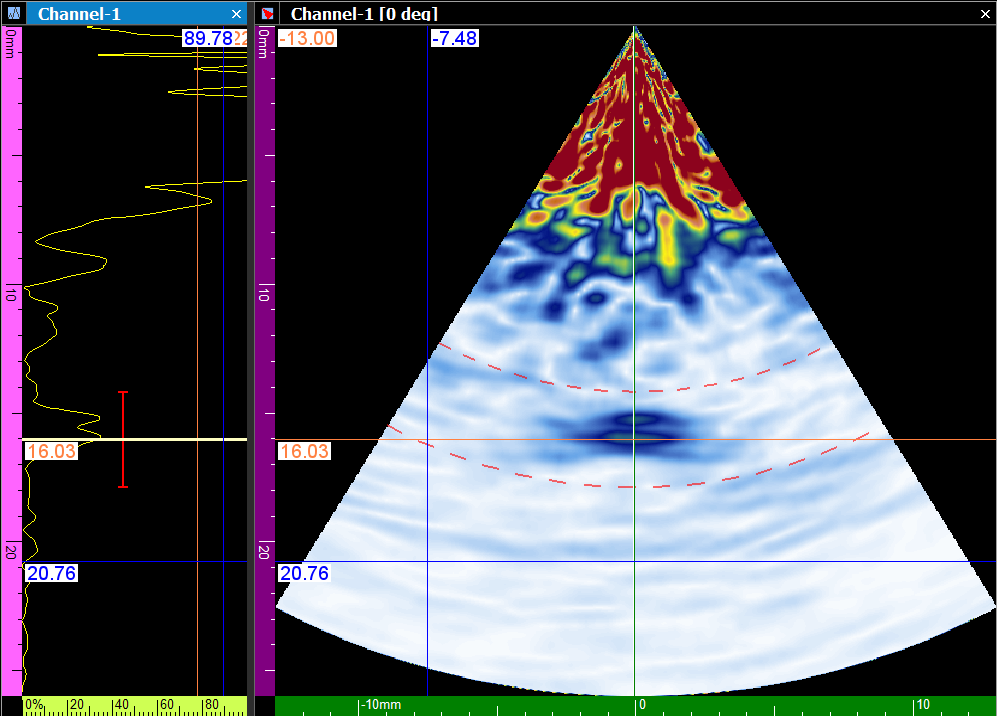

복합소재는 현대 산업에서 널리 사용되지만, 그 특유의 감쇠 특성 때문에 내부 결함을 탐지하는 것이 까다롭습니다. 이번 포스팅에서는 DEEPSOUND PAUT 시스템을 활용하여 복합소재 내부의 잠재적 결함을 얼마나 성공적으로 검출할 수 있는지 검증한 결과를 공유합니다.

---

## 테스트 시편 (Test Samples)

검증에 사용된 시편의 전면과 후면 모습입니다.

- **전면 (Front Side)**

- **후면 (Back Side)**

---

## 측정 방법 (Measuring Method)

웨지 없이 프로브를 샘플에 직접 배치하여 측정을 진행했습니다. PAUT S-scan에서 다양한 크기의 지점(Point #1 ~ Point #3)이 명확하게 식별되는지 확인하는 것이 주요 목표입니다.

- **사용 장비:** 2.25 MHz PAUT 프로브

- **각 신호 포인트 마킹 (Point #1 ~ #3)**

---

## 검사 포인트 #1 (Inspection Point #1)

- **Point #1 실제 두께:** 약 7.00 mm
- **검출된 반사 신호 위치:** 6.13 mm
- **관찰 결과:** S-scan에서 중간 고무층에서 반사되는 초음파 신호가 명확하게 표시됩니다.

- **Point #1 S-Scan 이미지**

---

## 검사 포인트 #2 (Inspection Point #2)

- **Point #2 실제 두께:** 약 11.00 mm
- **검출된 반사 신호 위치:** 10.38 mm
- **관찰 결과:** 지정된 깊이에서 명확한 반사 신호를 확인할 수 있습니다.

- **Point #2 S-Scan 이미지**

---

## 검사 포인트 #3 (Inspection Point #3)

- **Point #3 실제 두께:** 약 23.00 mm
- **검출된 반사 신호 위치:** 22.31 mm
- **관찰 결과:** S-scan에서 중간 고무층의 최대 두께 지점에서 반사되는 초음파 신호가 명확하게 표시됩니다.

- **Point #3 S-Scan 이미지**

---

## 결과 요약 및 결론 (Evaluation & Conclusion)

테스트 결과, 복합소재 시편 내의 각 지정된 검사 포인트에서 명확한 반사 신호가 검출됨을 확인했습니다.

1. **주파수 선택:** 이번 검사는 **2.25 MHz** 프로브를 사용했습니다. 감쇠가 심한 소재 특성상, 더욱 최적화된 결과를 얻으려면 2.25 MHz보다 낮은 주파수의 프로브 사용을 권장합니다.
2. **신호 감쇠 대응:** 복합소재는 본질적으로 초음파 감쇠가 심합니다. 비교 분석을 위해 결함이 없는 기준 샘플과 병행 측정하는 것이 좋으며, 신호가 약한 경우 송신 전압을 높여 대응해야 합니다.
3. **검증 완료:** 결과적으로, 이번 초음파 테스트를 통해 복합소재 내부 구조 변화를 종합적으로 검증할 수 있었습니다. 

DEEPSOUND 시스템은 복합소재와 같이 까다로운 매질에서도 신뢰할 수 있는 데이터를 제공하여 검사자가 공간적인 확신을 가지고 결함을 판독할 수 있도록 돕습니다.
