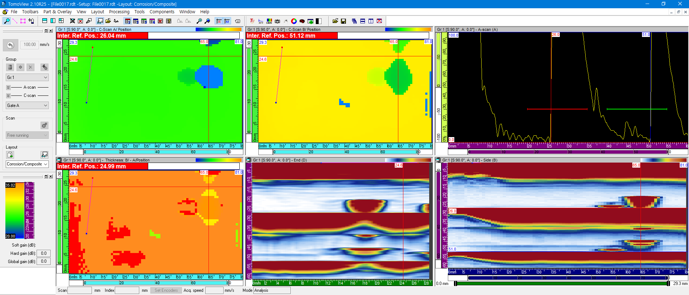
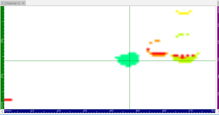
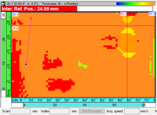

부식 데이터 분석은 미세한 두께 변화를 잡아내는 것이 핵심입니다. 이번 포스팅에서는 DEEPSOUND의 전용 분석 소프트웨어인 **DSViewer**와 타사의 분석 프로그램 간의 부식 맵(Corrosion Map) 분석 성능을 종합적으로 비교한 결과를 다룹니다.

---

## 분석 소프트웨어 개요

두 프로그램의 컬러맵(Colormap) 및 인터페이스 구성입니다.

- **DSViewer (DEEPSOUND)**

- **타사 분석 프로그램**

---

## 데이터 분석 비교 #1: 초기 결함 식별

데이터 로드 직후의 초기 결함 포착 능력을 비교했습니다.

- **DSViewer 인터페이스:** 커서 조정을 통해 A-scan 신호를 명확하게 관찰하고 위치를 파악할 수 있습니다.

- **타사 인터페이스**

---

## 데이터 분석 비교 #2: 신호 선명도

결함 경계 검출 및 신호의 선명도 비교입니다.

- **DSViewer 인터페이스**

- **타사 인터페이스**

---

## 데이터 분석 비교 #3: 국부 부식 분석

특정 지점의 국부적인 부식 상태를 조사한 결과입니다.

- **DSViewer 분석 뷰**

- **타사 분석 뷰**

---

## 결론 및 시사점 (Conclusion)

1. **색상 변조 (Color Modulation):** DSViewer는 두께 변화에 따른 색상 표시를 매우 정확하게 조정하여 직관적인 시각화 기능을 제공합니다.
2. **게이트 일관성 (Gate Consistency):** A 및 B 게이트 설정값에 따른 분석 결과가 타사 시스템과 매우 유사하여 데이터 신뢰성이 입증되었습니다.
3. **분석 정밀도:** 특정 데이터(데이터 #4)의 B-A 값 비교 시 두 프로그램 간 미세한 차이가 관찰되었으며, 이는 DSViewer의 감도 처리 방식이 매우 세밀함을 보여줍니다.

**DSViewer**는 현장에서 수집된 방대한 데이터를 사무실에서 정밀하게 분석하고 보고서를 작성하는 데 최적화된 강력한 도구입니다.
