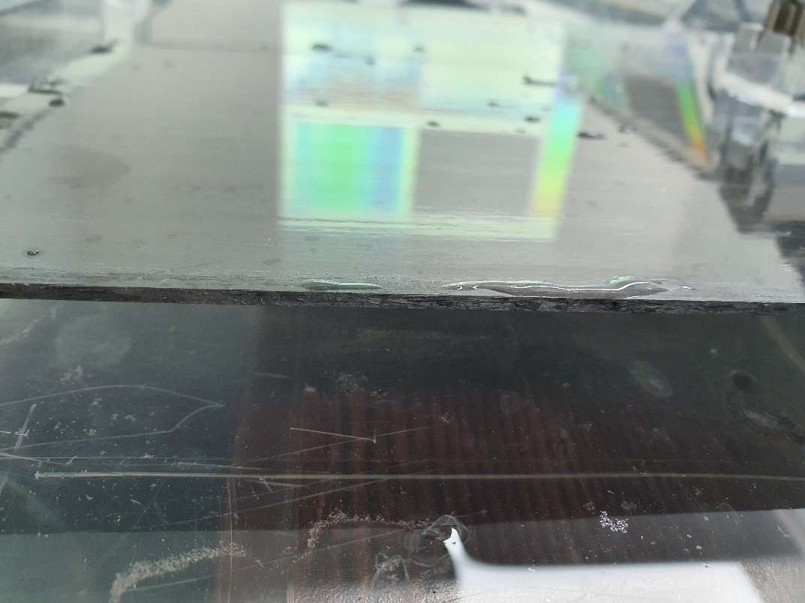
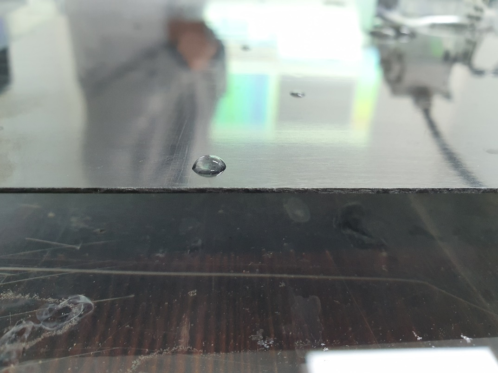
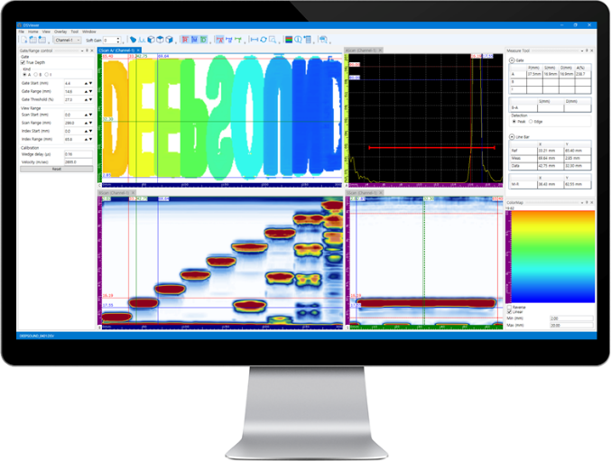
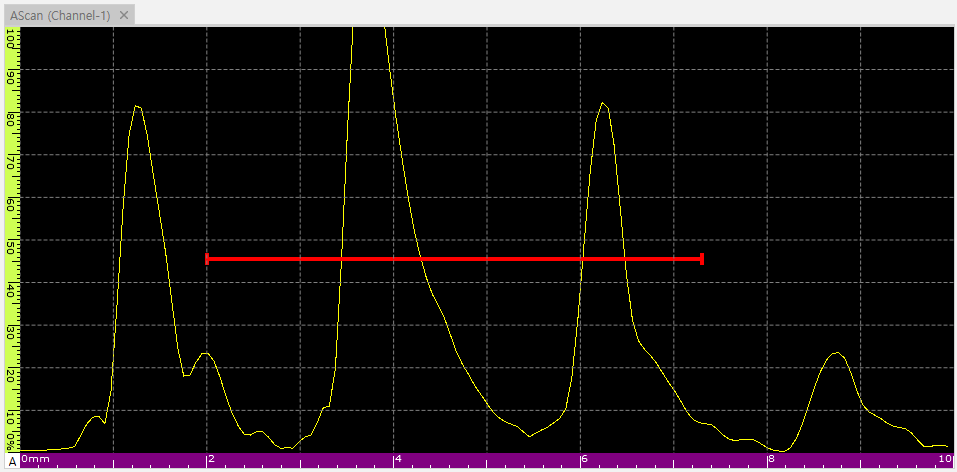
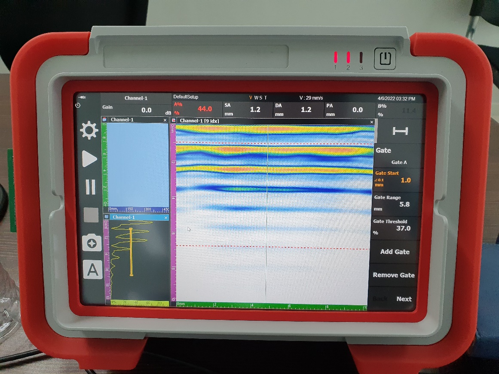
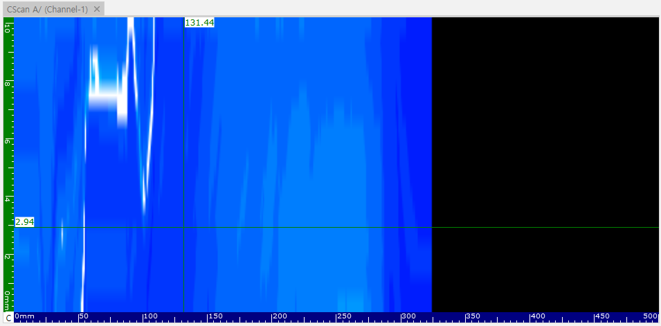
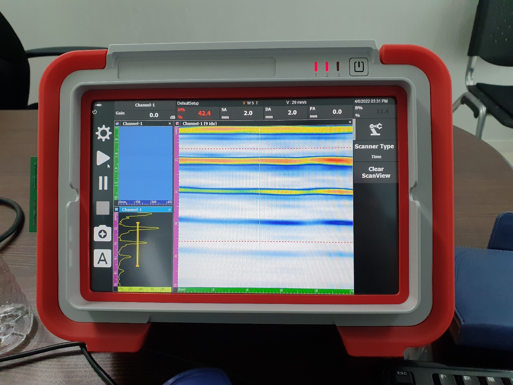
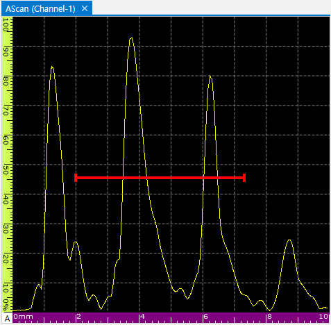
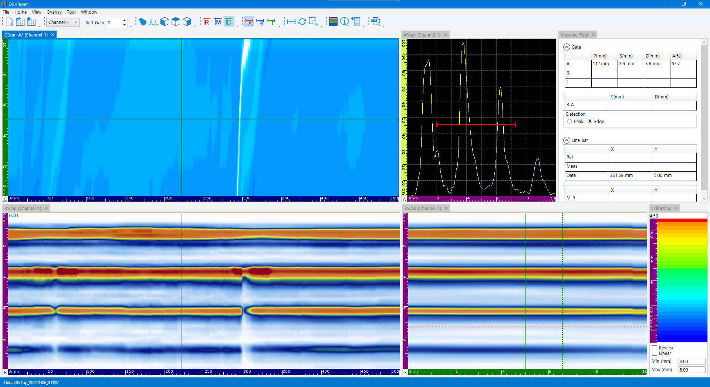

배관 및 설비의 안전성을 진단하는 데 있어 부식으로 인한 두께 감소를 측정하는 것은 매우 중요합니다. 이번 포스팅에서는 서로 다른 두 가지 샘플을 사용하여 부식 편차를 정확하게 식별하고 분석하는 전 과정을 공유합니다.

---

## 테스트 시편 (Test Samples)

서로 다른 두께 범위를 가진 두 가지 샘플을 준비했습니다.

- **샘플 #1 두께 범위:** 1.0 ~ 1.2 mm
- **샘플 #2 두께 범위:** 2.0 ~ 2.3 mm

- **샘플 #1**

- **샘플 #2**

---

## 사용 장비 및 소프트웨어 (Equipment & Software)

검사는 휴대용 PAUT 장비인 **DEEPSOUND P5**를 중심으로 진행되었습니다.

- **본체:** DEEPSOUND P5 (5 MHz 프로브 / 0도 웨지)

데이터의 시각화 및 정밀 분석을 위해 두 가지 소프트웨어가 사용되었습니다.
- **PAVision:** 휴대용 전용 소프트웨어로 초기 스캔 데이터 획득.
- **DSViewer:** 정밀 분석 소프트웨어로 로드하여 상세 부식 맵 분석.

- **현장용 PAVision**

- **분석 전용 DSViewer**

---

## 측정 원리 및 방법론 (Methodology)

소재의 두께 편차는 초음파 신호가 측정 게이트(Measurement Gate)와 교차하는 기준점의 이동으로 나타납니다. 이를 통해 변화를 실시간으로 관찰할 수 있습니다.

---

## 샘플 측정 결과 분석

### 샘플 #1 (Thickness: 1.0~1.2 mm)

- **소프트웨어 인터페이스 분석**

- **C-Scan 컬러 매핑 결과**

### 샘플 #2 (Thickness: 2.0~2.3 mm)

- **두께 매핑 인터페이스**

- **상세 컬러 매핑 결과**

---

## 분석 결론 (Conclusion)

1. **시각적 판독:** 컬러 매핑된 C-Scan을 통해 평균 두께와 국부적인 부식 지점을 즉각적으로 식별할 수 있습니다.
2. **정밀도:** 초음파 신호의 위치 이동을 0.01mm 단위로 추적하여 미세한 두께 감소를 놓치지 않고 포착했습니다.
3. **효율적 분석:** DSViewer의 전체 인터페이스 뷰를 활용하면 방대한 영역의 부식 상태를 한눈에 파악할 수 있어 리포트 작성 효율이 매우 높습니다.

**DEEPSOUND**의 솔루션은 현장의 빠른 검사(P5/PAVision)와 사무실의 정밀한 분석(DSViewer)을 연결하여 최고의 부식 진단 성능을 제공합니다.
