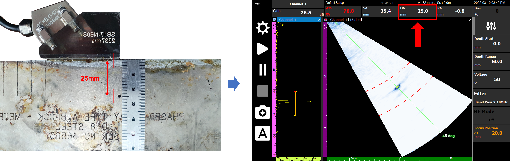

초음파 검사 중 화면 상단에 표시되는 다양한 수치들은 결함의 정확한 위치를 알려주는 핵심 지표입니다. 이번 포스팅에서는 **PA, DA, SA** 데이터의 의미와 이를 실제 물리적 거리와 대조하여 확인하는 방법을 설명합니다.

---

## 측정 데이터의 정의 (PA / DA / SA)

DEEPSOUND P5의 상단 메뉴에는 게이트를 통해 감지된 신호를 바탕으로 한 세 가지 주요 데이터가 표시됩니다.

- **PA (Projection Distance):** 프로브 전면부에서 결함까지의 수평 투영 거리
- **DA (Depth Distance):** 시편 표면에서 결함까지의 수직 깊이
- **SA (Surface Distance / Sound Path):** 프로브와 결함 사이의 실제 초음파 진행 경로 거리

---

## 실시간 데이터 확인 방법

상단 메뉴의 데이터 표시 영역을 길게 누르면 확인하고자 하는 데이터 유형(예: DA)을 선택하여 상시 모니터링할 수 있습니다.

---

## 물리적 거리와의 일치성 검증

교정이 완료된 시스템에서 이 데이터들은 실제 시편 내 결함 위치와 거의 완벽하게 일치합니다.

1. **PA (수평 거리):** 프로브의 전면(Front Face)이 결함 바로 위에 위치할 때 PA 값은 **0 mm**를 표시합니다. 프로브를 앞뒤로 움직임에 따라 이 수치는 실시간으로 변하며 수평 위치를 알려줍니다.
2. **DA (수직 깊이):** 테스트 시편의 결함이 표면으로부터 25 mm 아래에 있다면, 화면의 DA 값 역시 **25.0 mm**를 나타내야 합니다. (표준 허용 오차: +/- 0.5 mm)
3. **SA (빔 경로):** 45도 각도에서 25 mm 깊이의 결함을 탐지할 때, 피타고라스 정리에 따른 실제 빔 경로는 약 35 mm이며 이는 SA 값에 정확히 반영됩니다.

- **실제 깊이 25mm와 DA 측정값 25.0mm의 일치 확인**

- **빔 경로(SA)가 실제 물리적 거리와 일치하는 모습**

---

## 결론

PA, DA, SA 데이터는 단순한 숫자가 아니라, 검사자가 눈으로 볼 수 없는 시편 내부의 결함을 공간적으로 재구성해 주는 **'좌표계'**입니다. 이 수치들을 정확히 이해하고 활용하면 결함 리포트의 신뢰도를 극대화할 수 있습니다.

DEEPSOUND 시스템은 실시간 수치와 물리적 위치 사이의 오차를 최소화하여 사용자에게 확신 있는 검사 결과를 제공합니다.
