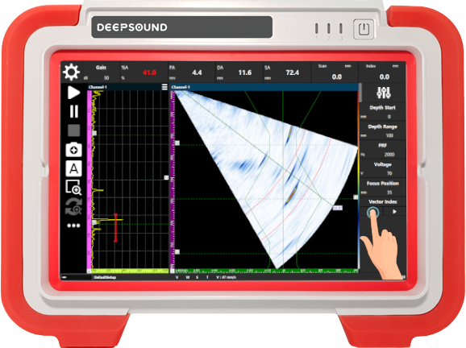
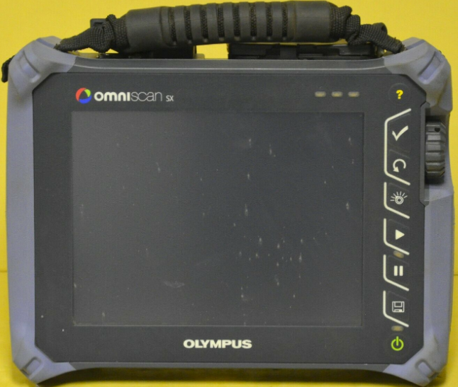
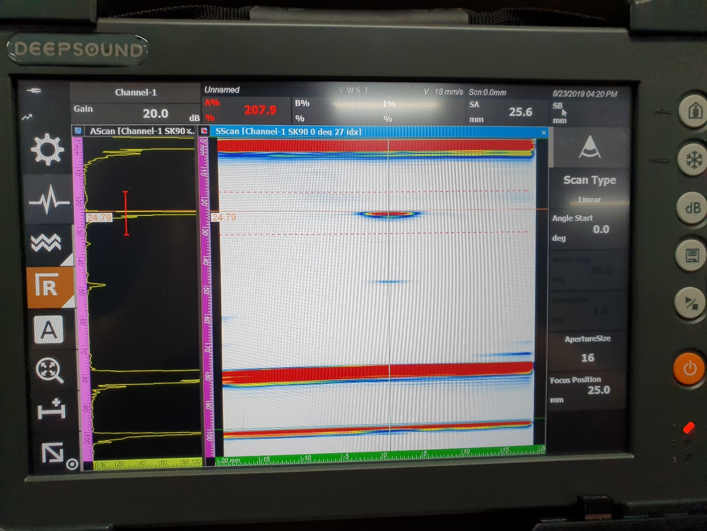

수침법(Immersion testing)은 물을 매질로 사용하여 정밀한 검사가 필요한 부품의 결함을 찾는 데 매우 효과적입니다. 이번 포스팅에서는 수침 환경에서 타사 장비와 DEEPSOUND P5의 결함 검출 능력을 직접 비교한 데이터를 공유합니다.

---

## 사용 장비 및 사양

정확한 비교를 위해 동일한 사양의 수침용 프로브와 웨지를 사용했습니다.

- **DEEPSOUND P5**

- **타사 비교 장비**

- **프로브 사양:** 5L128-I2 모델 / 0.6 mm Pitch
- **웨지 사양:** Water (수침식 전용)

---

## 결함 검출 비교 (Flaw Detection Comparison)

수침 환경에서 샘플 시편 내의 결함을 식별하고 각 장비별 오차 범위를 측정했습니다.

- **공통 파라미터 설정**

### 측정 데이터 비교

| 샘플 결함 위치 | DEEPSOUND P5 측정 | 오차 범위 | 타사 장비 측정 | 오차 범위 |
| :--------------------- | :------------ | :------------- | :-------------------- | :------------- |
| **25.00 mm (SA)**      | 25.60 mm (SA) | **+0.60 mm**   | 24.62 mm (SA)         | **-0.38 mm**   |

- **DEEPSOUND P5 분석 뷰**

- **타사 장비 분석 뷰**

---

## 분석 결과 및 결론 (Conclusion)

1. **성능 대등성:** 결함 위치 평가 측면에서 DEEPSOUND P5와 타사 장비는 매우 유사한 성능을 보였으며, 오차 범위 또한 실질적으로 동일한 수준으로 나타났습니다.
2. **신호 무결성:** 두 장비 모두 거의 동일한 A-scan 신호 패턴을 보여주어, 데이터의 신뢰성과 재현성이 확보됨을 확인했습니다.
3. **효율성:** DEEPSOUND P5는 수침법과 같은 정밀한 설정이 필요한 환경에서도 빠르고 정확한 데이터 수집이 가능함을 입증했습니다.

DEEPSOUND 시스템은 다양한 검사 환경(수침, 접촉식 등)에서 글로벌 표준에 부합하는 정밀한 데이터를 제공하여 최상의 검사 품질을 보장합니다.
