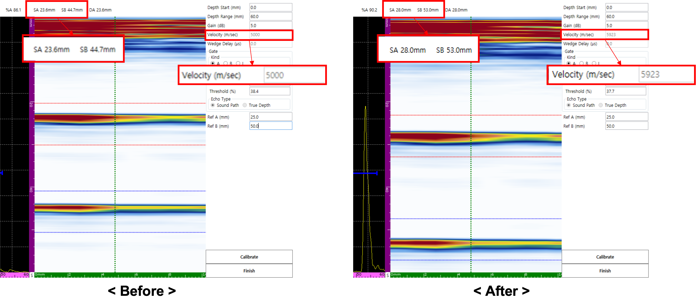

리니어 스캔(Linear Scan) 검사 시 결함의 위치가 부정확하다면 재질 음속이 제대로 교정되었는지 확인해야 합니다. 이번 포스팅에서는 **0.5 Skip**과 **1.0 Skip** 신호를 활용하여 선형 음속을 교정하는 방법을 상세히 설명합니다.

---

## 사전 준비

음속은 매질의 온도와 재질 조성에 따라 달라지므로, 반드시 **검사 대상과 동일한 재질의 교정 블록**을 준비해야 합니다.

---

## 음속 불일치로 인한 현상

장비에 설정된 음속과 실제 재질의 음속이 다르면, 아래와 같이 스킵(Skip) 위치의 신호 간격이 물리적 실제 거리와 다르게 나타납니다.

- **기준:** 0.5 Skip (25 mm) / 1.0 Skip (50 mm)
- **올바른 간격:** 25 mm

---

## 교정 프로세스

### 1. 교정 페이지 진입
메뉴의 설정 순서에 따라 **Velocity Calibration** 전용 페이지로 이동합니다.

### 2. 파라미터 및 기준값 설정
정밀한 신호 포착을 위해 Depth Range, Gain 등을 조절한 후, 실제 물리적 위치 값인 **Ref A (25 mm)**와 **Ref B (50 mm)**를 입력합니다.

### 3. 게이트 정렬 및 데이터 확인
A 게이트와 B 게이트를 각각 0.5 Skip과 1.0 Skip 신호에 위치시킵니다. 이때 감지된 위치 값(SA, SB)이 화면에 실시간으로 표시됩니다.

### 4. 음속 업데이트 (Calibrate)
**Calibrate** 버튼을 클릭하면 소프트웨어가 입력된 기준값을 바탕으로 재질 음속을 즉시 업데이트합니다. 업데이트 후 SA와 SB 값은 정확히 25 mm 간격으로 정렬됩니다.

---

## 완료 및 저장

모든 과정이 끝나면 **Finish**를 눌러 설정을 저장합니다. 화면 하단의 상태 표시 레이블 중 **'V'**가 주황색으로 활성화되며 교정이 성공적으로 완료되었음을 알려줍니다.

정확한 선형 음속 교정은 리니어 스캔 이미징의 정확도를 보장하며, 복잡한 용접부 검사에서 결함의 위치를 오판할 위험을 획기적으로 줄여줍니다.
