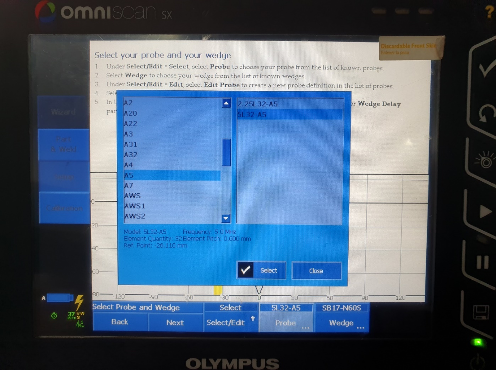
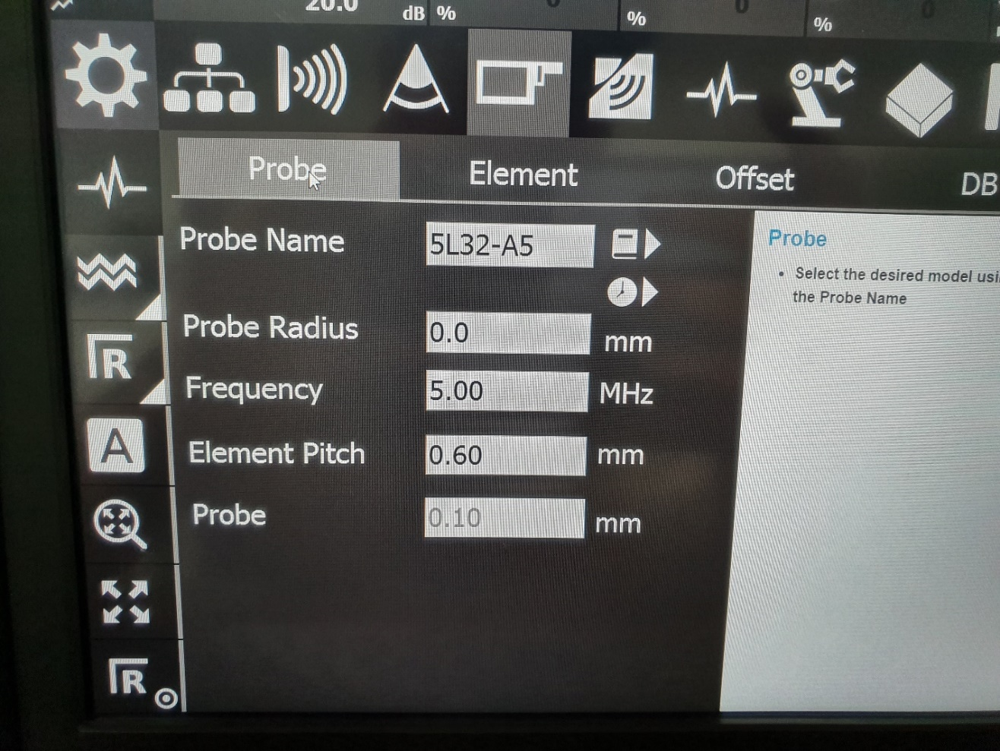
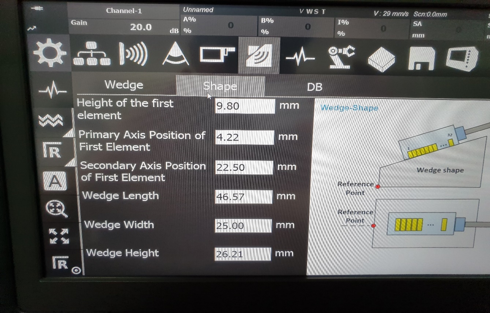
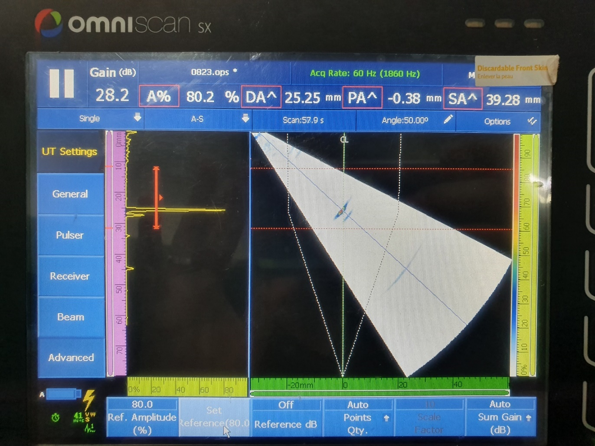
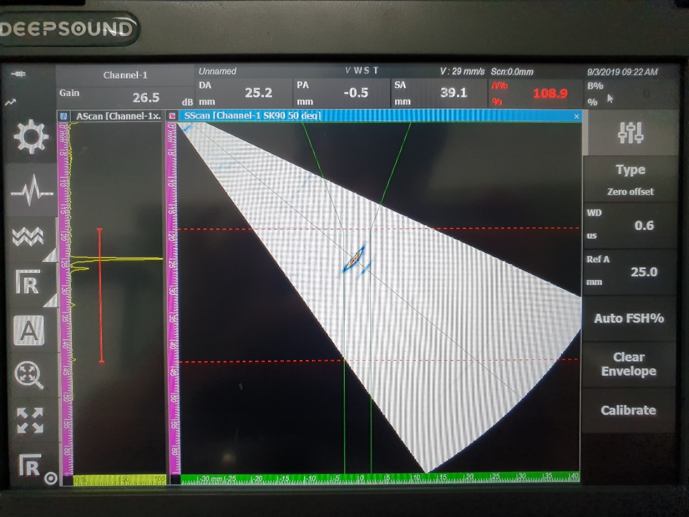
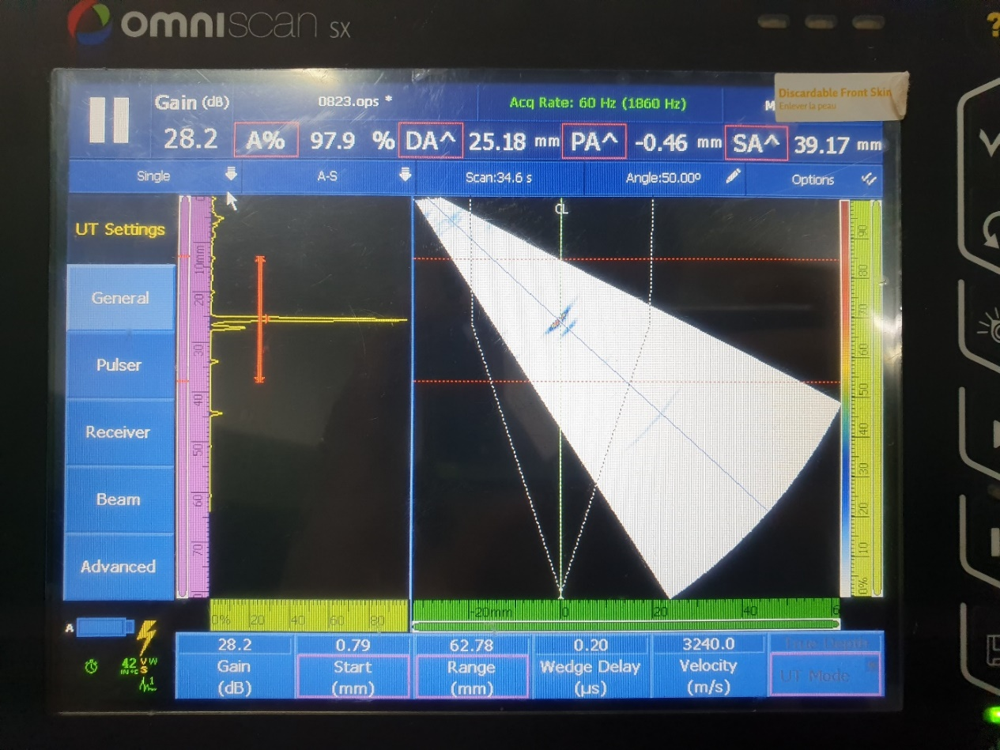
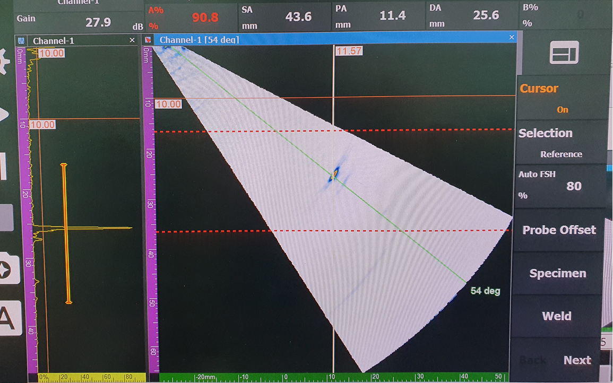

타사 장비와 DEEPSOUND P5 간의 결함 위치 정확도 및 교정(Calibration)의 영향을 검증하기 위한 비교 테스트입니다.

---

## Test Setup

두 시스템의 프로브 및 웨지 구성은 다음과 같습니다.

*타사 장비 프로브 사양*

*타사 장비 웨지 사양*

*테스트 시편*

*P5 장비 프로브 사양*

*P5 장비 웨지 사양*

*P5 장비 스캔 구성 설정*

---

## PA & DA Comparison: Defect Identification

타사 장비와 DEEPSOUND P5의 파라미터 및 결함 측정 기준을 설정하고 아래와 같이 검증했습니다.

---

## Image Results

두 장치에서 획득한 S-scan 이미지의 직접적인 시각적 비교입니다.

---

## Detailed Evaluation

검출된 신호 품질 및 위치 정확도에 대한 추가 비교입니다.

---

## Comparative Data Verification

두 시스템에서 검출된 위치 간의 차이 분석입니다.

---

## Conclusion

비교 분석 결과, **웨지 지연 교정(Wedge delay calibration)**을 적용하면 두 장치 모두에서 PA 및 DA 판독값에 차이가 발생하는 것을 확인했습니다.

두 시스템 모두에 웨지 지연을 활성화하여 적용했음에도 불구하고, 실제 결함의 물리적 위치와는 미세한 차이가 남아 있었습니다.

전반적으로, 결함을 정확히 찾아내는 검출 능력과 정확도는 **DEEPSOUND P5와 타사 장비 간에 매우 대등함**이 입증되었습니다.
