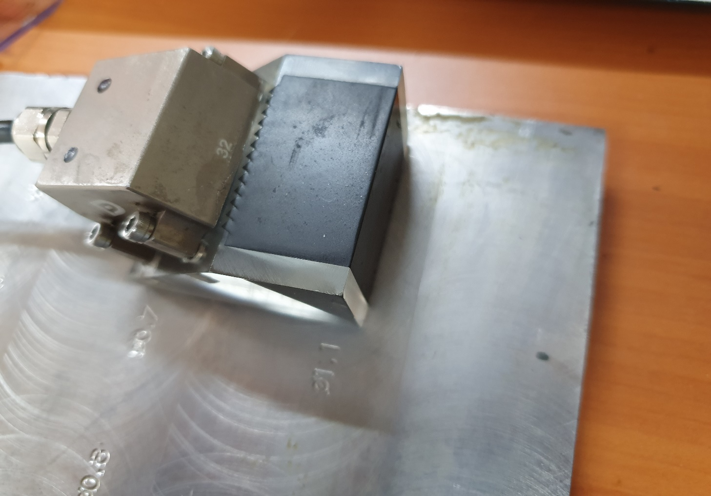
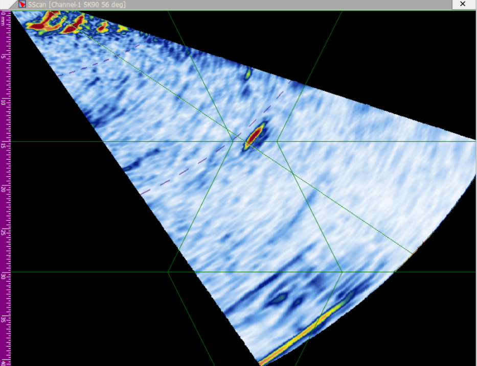
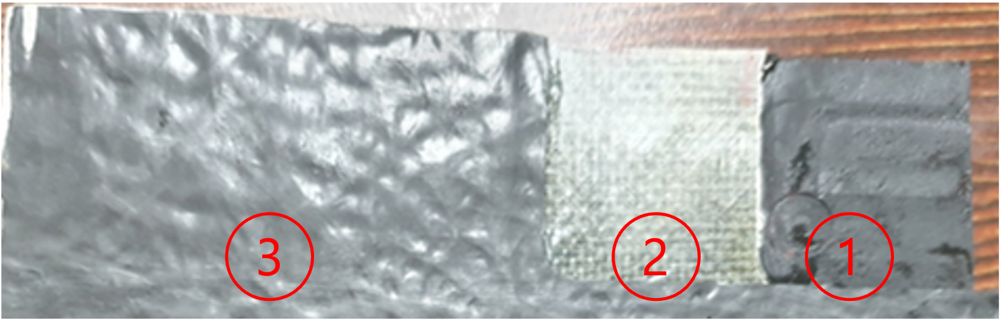
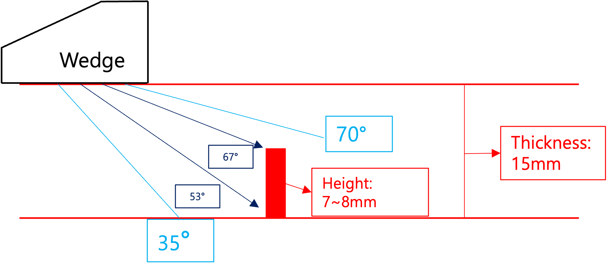
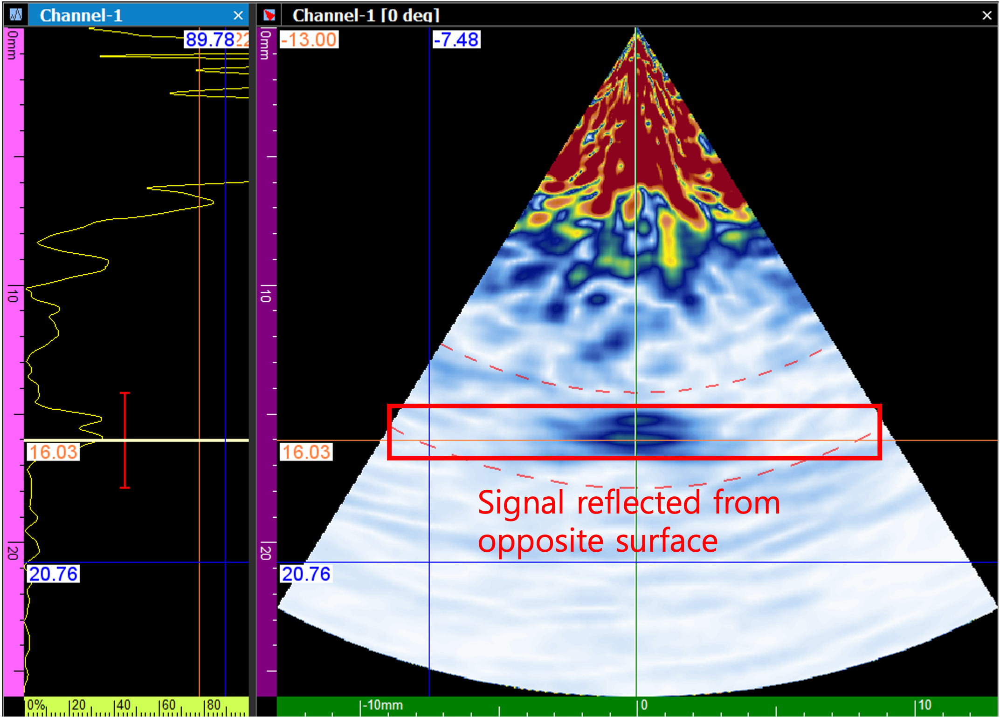
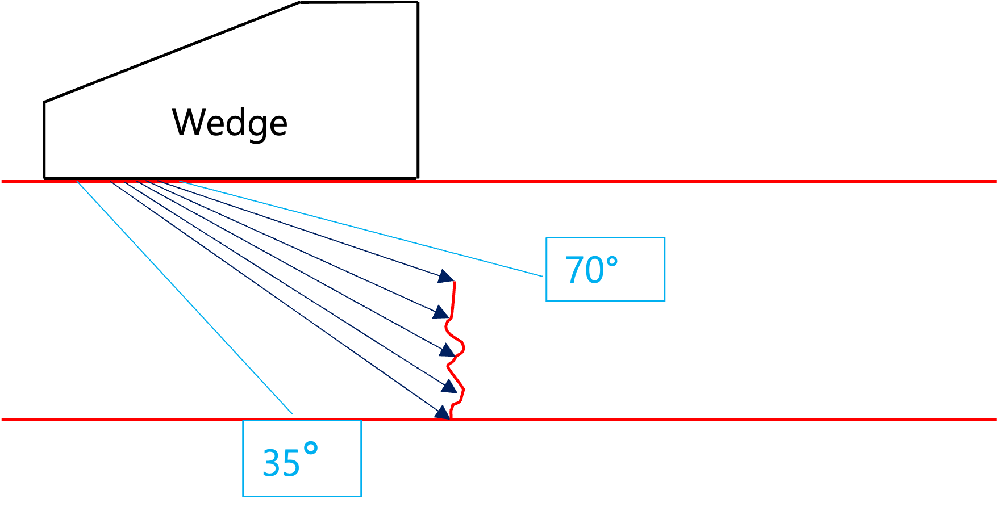

# PAUT 결함 식별 결과

## Test Specimen and Procedure

- **테스트 시편 데이터**

1. **소프트웨어:** DSVision
2. **장비 본체:** DEEPSOUND R3
3. **프로브:** 5L32-0.6
4. **웨지:** SB17-N60S

- **소프트웨어 설정**

1. **범위 (Range):** 50 mm
2. **전압 (Voltage):** 100 V
3. **빔 유형 (Beam Type):** Sectorial (섹터형)
4. **디지털 주파수:** 25 MHz
5. **빔 각도:** 35 ~ 70도
6. **엘리먼트 수:** 16
7. **TX (송신):** 16 / **RX (수신):** 16
8. **초점 위치 (Focus Position):** 6 mm
9. **필터:** 3 MHz ~ 7 MHz
10. **이득 값 (Gain):** 40 dB

---

## Locating Defect in Specimen

- S-scan 이미지를 참조하여 웨지의 위치를 이동시키면서 결함의 위치를 정확하게 찾아냅니다.

- **결함 위치 확인**

- **웨지 바로 정면에 위치한 결함 이미지**

---

## Interpreting Image Data

- **결함의 S-Scan 검사**

- **시편을 통해 전파되는 UT 신호 다이어그램**

| 검출된 상단 부분 깊이 (mm) | 검출된 하단 부분 깊이 (mm) |
| :----------------------------------- | :----------------------------------- |
| 7.26                                 | 15.03                                |

- **1.** 테스트 피스의 두께와 결함의 정확한 높이를 알고 있기 때문에, 반사된 신호가 결함의 어느 부분에서 발생하는지 정확하게 판단할 수 있습니다.
- **2.** 결함의 상단 부분은 표면적이 상대적으로 작기 때문에 신호를 명확하게 관찰하려면 수신 이득(Gain)을 높여야 합니다. 반면, 하단 부분은 표면적이 더 넓어 반사 신호가 즉시 확인됩니다.

---

## Shapes of Defects

- **뚜렷한 반사체가 부족한 드릴 구멍 결함**

- **뚜렷한 반사체를 가진 결함**

- **반사체를 가진 결함의 해당 S-Scan 이미지**

- **1.** 상기 드릴 구멍과 같이 반사체가 뚜렷하지 않은 매끄러운 결함의 이미지를 정확하게 포착하는 것은 본질적으로 어렵습니다. 이는 프로브가 매끄러운 표면에서 일정하게 튕겨 나가는 초음파를 효과적으로 감지할 수 없기 때문입니다.
- **2.** 반대로, 결함의 표면이 고르지 않거나 뚜렷한 반사체가 있는 경우 초음파가 여러 방향으로 산란됩니다. 이러한 산란파 중 일부는 반드시 수신 센서로 돌아오게 되므로, S-scan 이미지에서 결함의 형상이 명확하게 표현될 수 있습니다.

---

## Conclusion

- **식별이 어려운 인공 시편 결함**

- **식별이 쉬운 자연적으로 형성된 결함**

- **1.** 테스트 시편에 정밀하게 가공된 인공 결함은 매끄러운 기하학적 구조 때문에 정확하게 탐지하고 이미징하는 것이 특히 어려울 수 있습니다. 그러나 자연적으로 발생한 결함은 매우 불규칙하고 다방향적인 형상을 갖는 경향이 있어, 본질적으로 더 강력하고 일관된 반사 신호를 프로브로 되돌려 보냅니다. 따라서 이러한 자연 발생 결함은 S-scan 이미지 내에서 훨씬 더 정확하고 정의된 형상으로 나타납니다.
- **2.** 초음파 탐상(UT)은 반사된 음향 신호를 그래픽 데이터로 처리하는 방식에 전적으로 의존하기 때문에, 결함의 특정 형상을 식별하는 데 겪는 모든 어려움은 거의 항상 결함 자체의 물리적 기하학 구조와 방향에 의해 결정됩니다.
