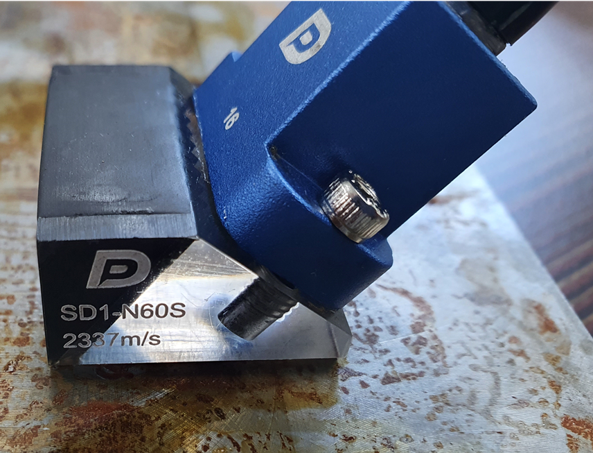
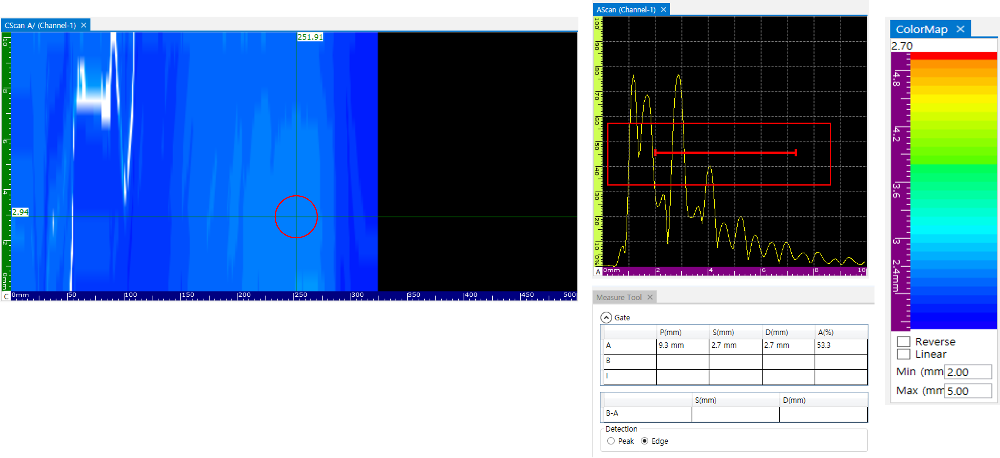
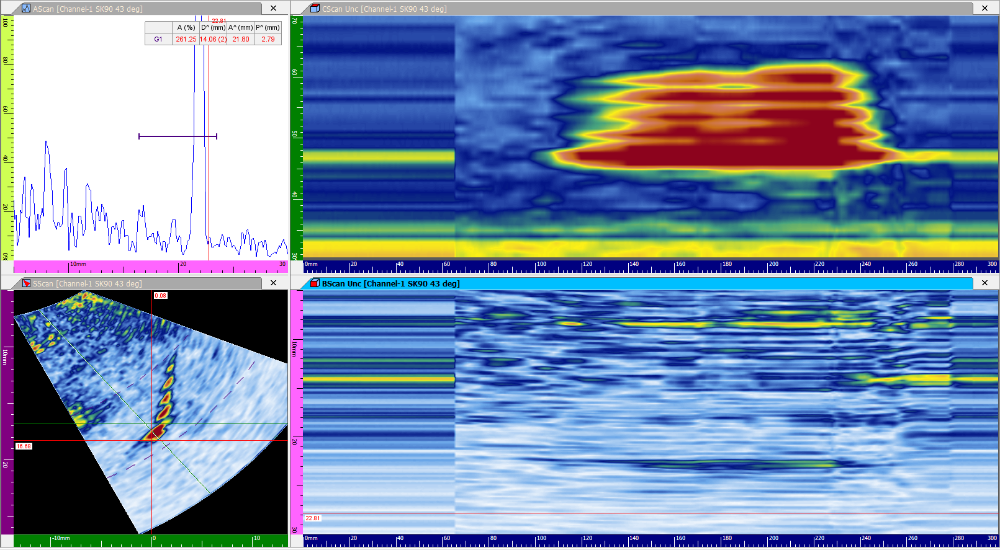
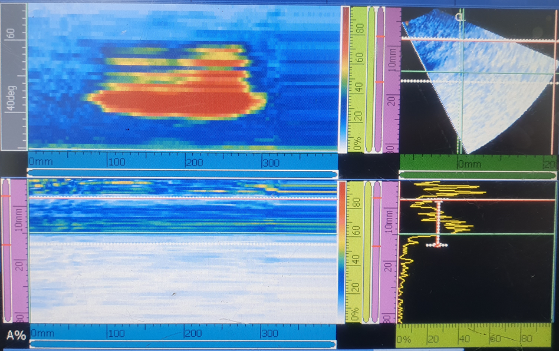
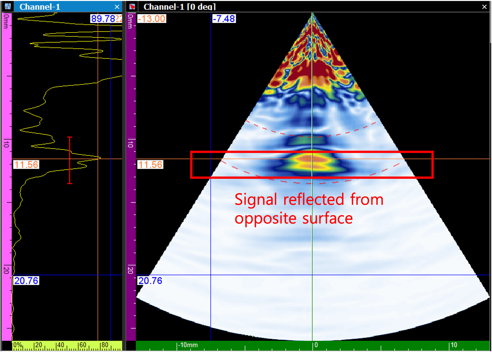
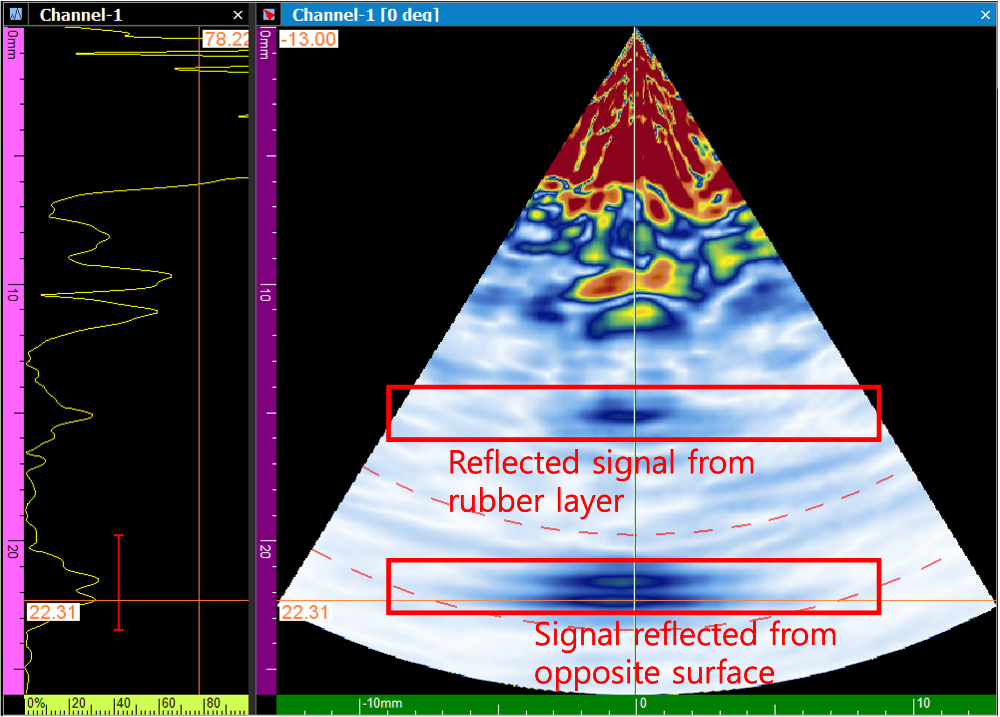
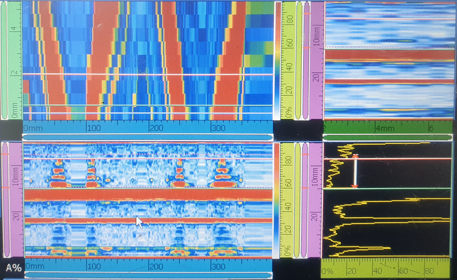

비파괴 검사 현장에서 장비의 정밀도는 곧 데이터의 신뢰도로 이어집니다. 이번 포스팅에서는 다양한 크기의 결함이 포함된 테스트 블록을 사용하여, 타사 장비와 DEEPSOUND 시스템이 결함 형상을 얼마나 정확하게 포착하는지 비교 분석한 결과를 공유합니다.

---

## 테스트 샘플 개요 (Test Sample Overview)

다양한 크기의 구멍이 뚫린 테스트 블록을 사용하여 측정을 진행했습니다.

---

## 탐촉자 및 웨지 사양 (Probe & Wedge Info)

정확한 비교를 위해 동일한 조건의 프로브와 웨지를 사용했습니다.

- **프로브 사양:** 10 MHz / 16 El / 0.6 mm Pitch
- **웨지 사양:** 38도 각도 / 2337 m/s 속도 / 15 mm 높이
- **특이사항:** 각 제조사의 고유 기준에 따라 첫 번째 엘리먼트 오프셋(Offset)을 최적화했습니다.

---

## 섹터 스캔 비교 (Sectorial Scan Comparison)

타사 장비와 DEEPSOUND 장비에서 생성된 S-scan 결함 측정 이미지의 시각적 비교입니다.

- **섹터 스캔 파라미터 설정**

- **S-scan 이미지 비교 (상단: DEEPSOUND / 하단: 타사 장비)**

### 정밀 분석 결과

- **DEEPSOUND S-scan 데이터**

- **타사 장비 S-scan 데이터**

---

## 리니어 스캔 비교 (Linear Scan Comparison)

샘플의 단면을 보다 명확하게 시각화하기 위해 리니어 스캔을 병행했습니다.

- **리니어 스캔 파라미터 설정**

- **리니어 스캔 이미지 비교**

### 정밀 분석 결과

- **DEEPSOUND 리니어 데이터**

- **타사 장비 리니어 데이터**

---

## 결론 (Conclusion)

1. **데이터 일관성:** DEEPSOUND와 타사 장비 모두 동일한 설정 하에서 매우 유사하고 일관된 결함 이미지를 생성했습니다.
2. **형상 식별:** S-scan 이미지는 주로 결함의 상단 가장자리를 강조하는 특성을 보였습니다.
3. **효율성:** 리니어 스캔 이미지는 샘플의 가장 넓은 단면을 명확하게 시각화하는 데 더 효과적임이 입증되었습니다.

DEEPSOUND 시스템은 글로벌 표준 장비들과 대등하거나 그 이상의 데이터 품질을 제공하며, 특히 직관적인 인터페이스를 통해 현장 분석 속도를 높여줍니다.
