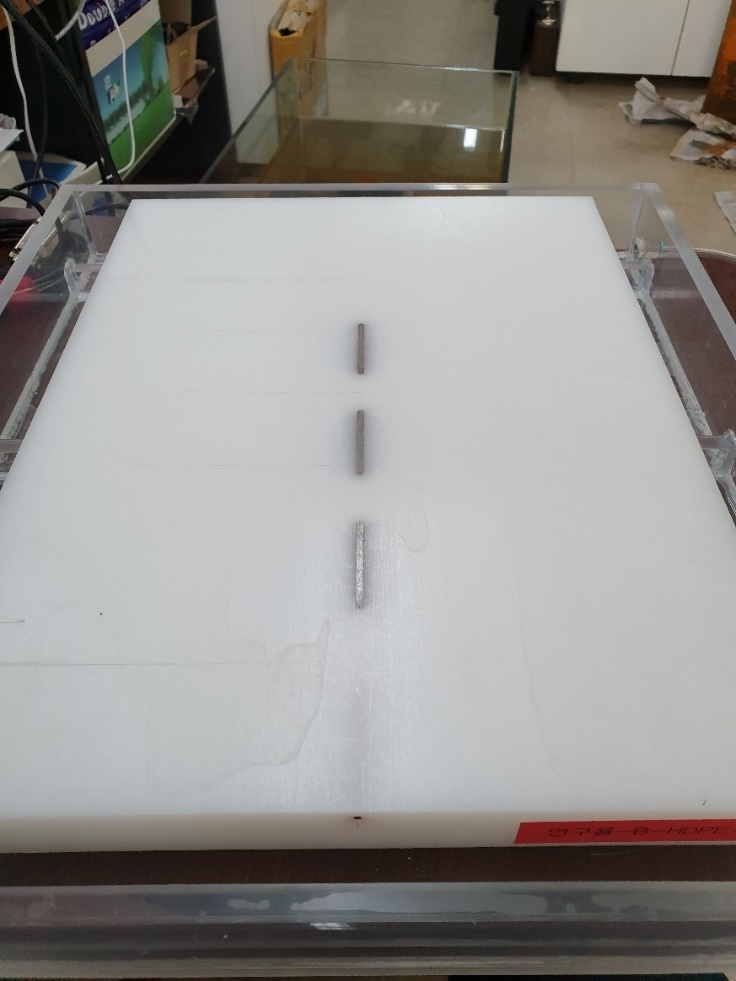
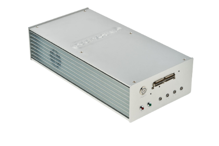
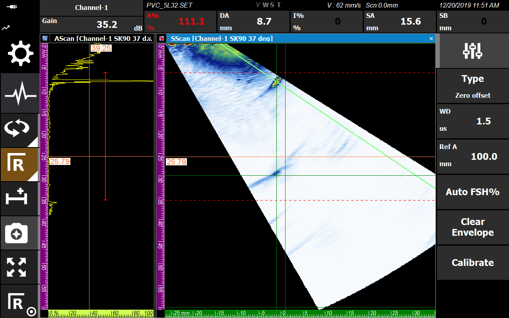
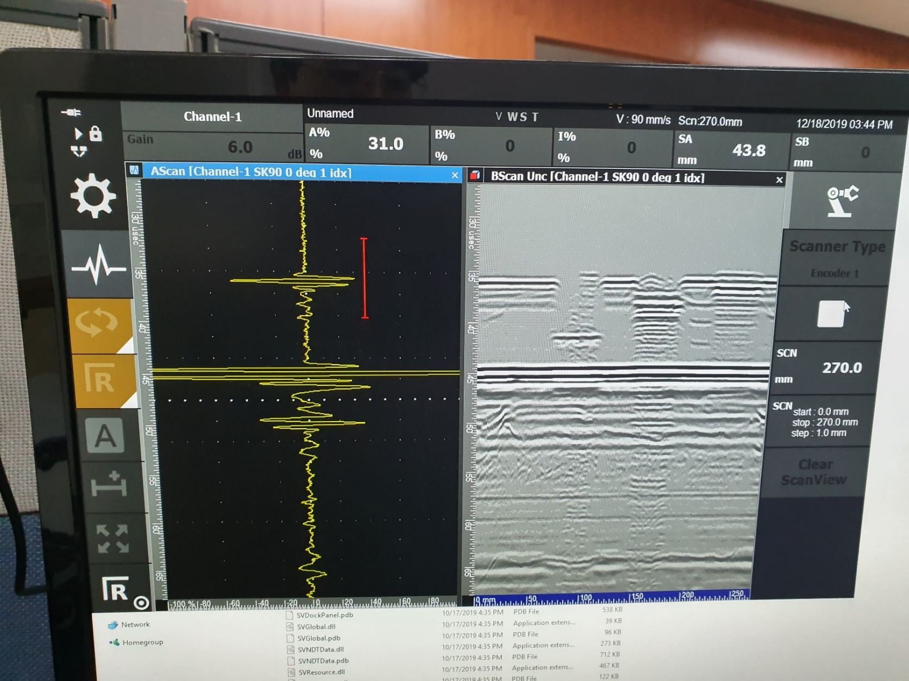
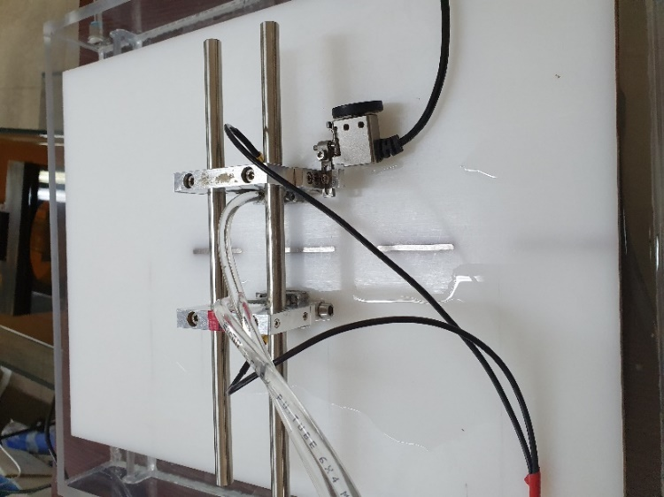

위상배열 초음파 탐상(PAUT)과 회절시간차법(TOFD)은 현대 비파괴 검사에서 가장 강력한 두 가지 기술입니다. 이번 포스팅에서는 DEEPSOUND R3 시스템을 활용하여 PVC 시편 내의 결함을 얼마나 정확하게 식별할 수 있는지 검증한 결과를 공유합니다.

---

## 테스트 시편 및 환경 (The Test Piece)

이번 검증의 주요 목적은 DEEPSOUND R3가 특정 결함 위치(1, 2, 3번)를 얼마나 정밀하게 측정하는지 확인하는 것입니다.

*PVC 테스트 시편 상단 (Top Surface)*

- **재질:** 사각형 PVC
- **두께:** 29.75 mm
- **결함 위치 (상단으로부터):** 9.00 mm / 15.00 mm / 22.50 mm

### 테스트 장비 구성
1. **장비 본체:** DEEPSOUND R3
2. **프로브:** 2.25~5L32 - N45~60S
3. **스캐너:** 전용 엔코더 포함 스캐너

*DEEPSOUND R3 장비 및 스캔 설정*

---

## 결함 측정 결과 (Defect Measurements)

각 결함의 실제 깊이 값과 R3 장비가 실시간으로 포착한 데이터 수치(DA)를 비교해 보십시오.

### 결함 #1 측정 (실제 9.0 mm)
R3 장비 측정 결과 **8.7 mm (DA)** 깊이에서 결함이 선명하게 검출되었습니다. 실제 위치와 비교하여 단 **0.3 mm**의 매우 낮은 오차 범위를 보여줍니다.

*결함 1번: 측정 깊이 8.7 mm (실제 9.0 mm)*

### 결함 #2 측정 (실제 15.0 mm)
2번 결함의 경우 실제 위치 15.0 mm 대비 **15.9 mm (DA)**로 측정되어 매우 안정적인 성능을 입증했습니다.

*결함 2번: 측정 깊이 15.9 mm (실제 15.0 mm)*

### 결함 #3 측정 (실제 22.5 mm)
가장 깊은 곳에 위치한 3번 결함 역시 **23.0 mm (DA)**에서 정확하게 포착되었습니다.

*결함 3번: 측정 깊이 23.0 mm (실제 22.5 mm)*

---

## TOFD 정밀 탐상 분석

DEEPSOUND 시스템은 TOFD(Time of Flight Diffraction) 방식을 이용한 고정밀 결함 탐지도 완벽하게 지원합니다.

*TOFD 방식의 고해상도 흑백 회절 데이터*

*송신/수신 전용 센서가 장착된 스캐너 배치 구조*

- **TOFD의 장점:** 결함의 정확한 길이와 수직 깊이를 극도로 정밀하게 측정할 수 있으며, 데이터 처리 속도가 매우 빠릅니다.
- **적용 범위:** 얇은 배관(5mm 미만)에는 TOFD를 주로 사용하며, 두꺼운 배관에는 PAUT와 병행하여 시너지 효과를 냅니다.

---

## 결론 (Conclusion)

이번 검증을 통해 DEEPSOUND R3 시스템은 **1mm 이내의 높은 정확도**를 성공적으로 입증했습니다.

### 최종 측정 데이터 요약

| 결함 번호 | 실제 깊이 (mm) | 측정 깊이 (DA, mm) | 오차 (mm) |
| :--- | :--- | :--- | :--- |
| **Defect #1** | 9.00 | 8.70 | **0.30** |
| **Defect #2** | 15.00 | 15.90 | **0.90** |
| **Defect #3** | 22.50 | 23.00 | **0.50** |

초음파 탐상(UT)은 결함 자체의 기하학적 구조와 방향에 따라 난이도가 달라지지만, DEEPSOUND R3는 PAUT와 TOFD의 결합을 통해 모든 영역에서 바이어가 신뢰할 수 있는 정밀한 데이터를 제공합니다.
