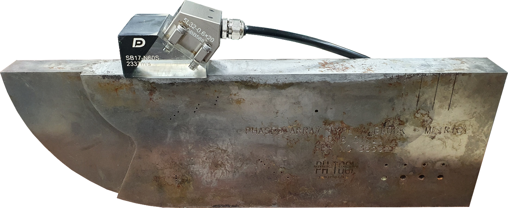

초음파 검사에서 가장 기초가 되는 단계는 **재질별 음속(Velocity)을 정확하게 설정**하는 것입니다. 음속이 틀리면 화면상의 모든 거리 데이터가 왜곡됩니다. 이번 포스팅에서는 R50(50mm)과 R100(100mm) 반경을 활용한 **반경 음속 교정** 방법을 알아보겠습니다.

---

## 준비 사항

- 검사하려는 대상 시편과 동일한 재질의 교정 시편 (예: V1 또는 V2 블록)
- DEEPSOUND P5 장비 및 적절한 프로브/웨지 조합

---

## 왜 음속 교정이 필요한가?

장비가 실제 재질의 음속으로 설정되지 않으면, 화면상에 나타나는 R50과 R100 신호 사이의 간격이 실제 물리적 거리인 50mm와 다르게 표시됩니다. 이는 모든 결함 위치 측정에 오차를 발생시킵니다.

---

## 교정 단계별 절차

### 1. 음속 교정 페이지 진입
메뉴의 숫자 순서에 따라 **Velocity Calibration** 페이지로 이동합니다.

### 2. 기준값(Reference) 설정
물리적 기준인 R50과 R100을 활용하기 위해 **Ref A를 50 mm**, **Ref B를 100 mm**로 각각 설정합니다.

### 3. 게이트 정렬 및 신호 포착
A 및 B 게이트를 각각 R50과 R100 신호 위치로 이동시킵니다. 이때 각 게이트를 통과하는 실제 측정값(SA, SB)이 화면에 실시간으로 표시됩니다.

### 4. 자동 교정 실행 (Calibrate)
**Calibrate** 버튼을 누르면 소프트웨어가 SA와 SB 사이의 간격을 분석하여 내부 음속 값을 자동으로 업데이트합니다. 이제 화면상의 두 신호 간격은 정확한 50 mm로 조정됩니다.

---

## 완료 확인

모든 과정이 끝나고 **Finish**를 누르면, 장비 하단의 상태 표시 레이블 중 **'V'**가 주황색으로 활성화됩니다. 이는 시스템이 해당 재질의 음속으로 완벽하게 동기화되었음을 의미합니다.

정확한 음속 교정은 신뢰할 수 있는 비파괴 검사의 시작입니다. DEEPSOUND P5의 직관적인 교정 프로세스를 통해 현장에서 쉽고 빠르게 정확도를 확보해 보세요.
