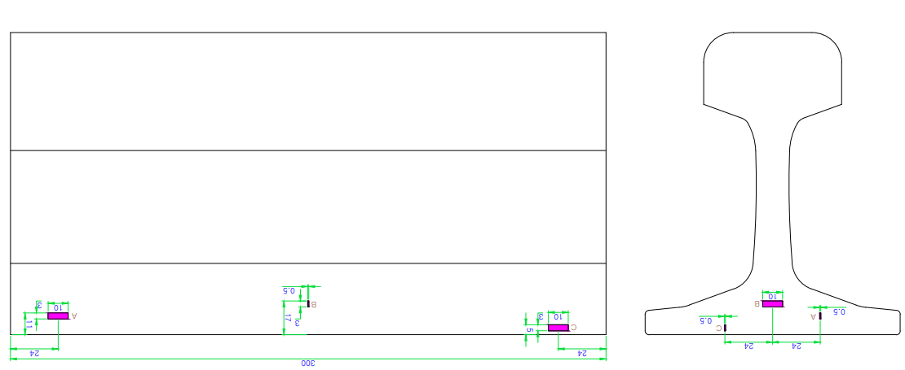
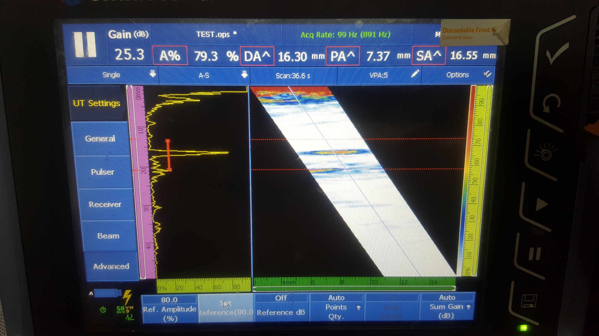
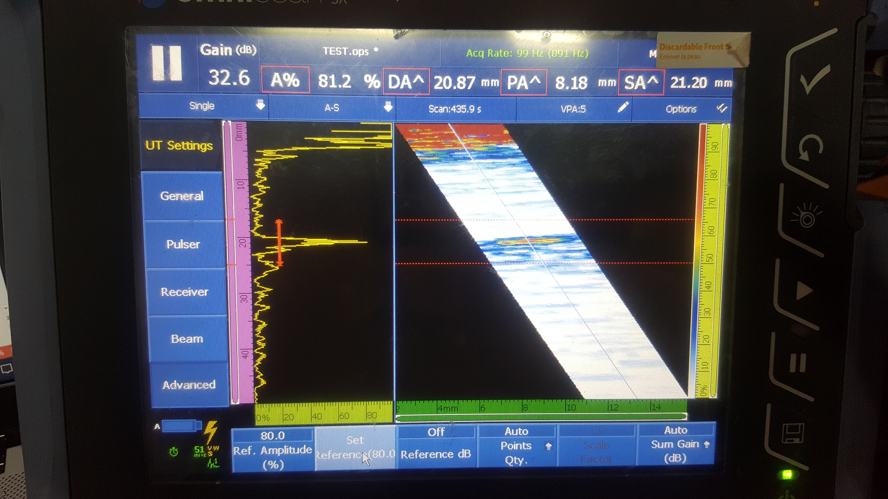

철도 검사는 아주 미세한 균열이나 결함도 큰 사고로 이어질 수 있어 매우 높은 수준의 정밀도와 신속한 판독 능력이 요구됩니다. 이번 포스팅에서는 특정 철도 샘플 시편을 활용하여 타사 장비와 DEEPSOUND P5의 실제 성능을 비교 평가한 결과를 공유합니다.

---

## 사용 장비 및 구성

- **제품명:** DEEPSOUND P5 (12.1인치 대화면 터치 시스템)

- **제품명:** 타사 비교 장비

### 검사 사양
- **프로브:** 10 MHz 대역 (상세 이미지 참조)
- **웨지:** SA1-N55S (55도 강재용 웨지)

---

## 테스트 시편 및 방법 (Test Specimen)

철도 레일 내부의 구조와 유사한 테스트 시편을 사용하여 결함 위치를 분석했습니다.

---

## 분석 결과 #1: 리니어 스캔 (Wedge 미사용)

웨지 없이 프로브를 직접 배치하여 리니어 스캔을 수행한 결과, 깊이 축(DA) 값의 차이가 1mm 이내로 매우 대등한 정확도를 보여주었습니다.

| 결함 번호 | DEEPSOUND P5 DA (mm) | 타사 장비 DA (mm) | 차이 (mm) |
| :----: | :------------------- | :---------------------------- | :-------------- |
| **#1** | 16.30                | 16.30                         | **0.00**        |
| **#2** | 20.30                | 20.87                         | **0.57**        |
| **#3** | 10.80                | 11.04                         | **0.24**        |

---

## 분석 결과 #2: 섹터 스캔 (Wedge 사용)

실제 철도 검사 환경과 유사하게 웨지를 장착하고 섹터 스캔(35~70도)을 수행한 결과입니다.

| 결함 번호 | DEEPSOUND P5 DA (mm) | 타사 장비 DA (mm) | 차이 (mm) |
| :----: | :------------------- | :---------------------------- | :-------------- |
| **#1** | 15.60                | 15.89                         | **0.29**        |
| **#2** | 19.30                | 19.64                         | **0.34**        |
| **#3** | 10.81                | 11.01                         | **0.20**        |

---

## 최종 비교 결과 요약

| 카테고리 | DEEPSOUND P5 | 타사 장비 |
| :--- | :--- | :--- |
| **이미지 선명도** | **매우 뛰어남** (접근성 및 판독 용이) | 낮음 (정확한 검사에 한계) |
| **결함 형상 판독** | **경계가 뚜렷함** (크기 측정 간편) | 흐릿함 (정밀 측정 복잡) |
| **프로그램 속도** | **빠름 (1초 미만)** | 느림 (2-5초 지연) |

### 결론

이번 철도 검증 테스트를 통해 **DEEPSOUND P5**는 빠른 응답 속도와 선명한 이미지 품질을 결합하여, 글로벌 표준 대안 제품보다 훨씬 더 정밀하고 효율적인 결함 검출을 보장함을 입증했습니다. 특히 복잡한 철도 구조물 내에서도 명확한 시각적 근거를 제공하여 검사의 신뢰도를 획기적으로 높여줍니다.
