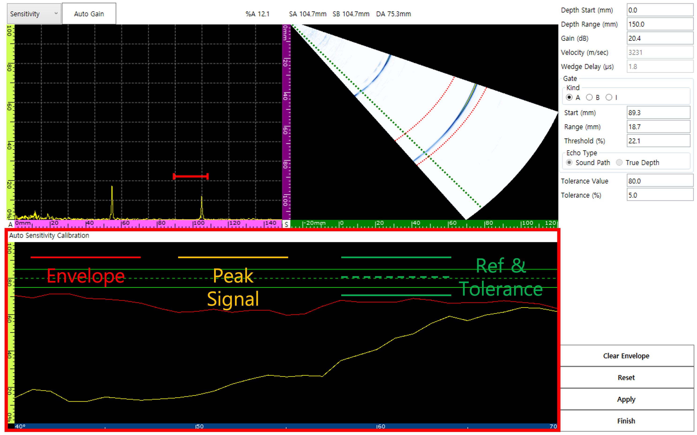
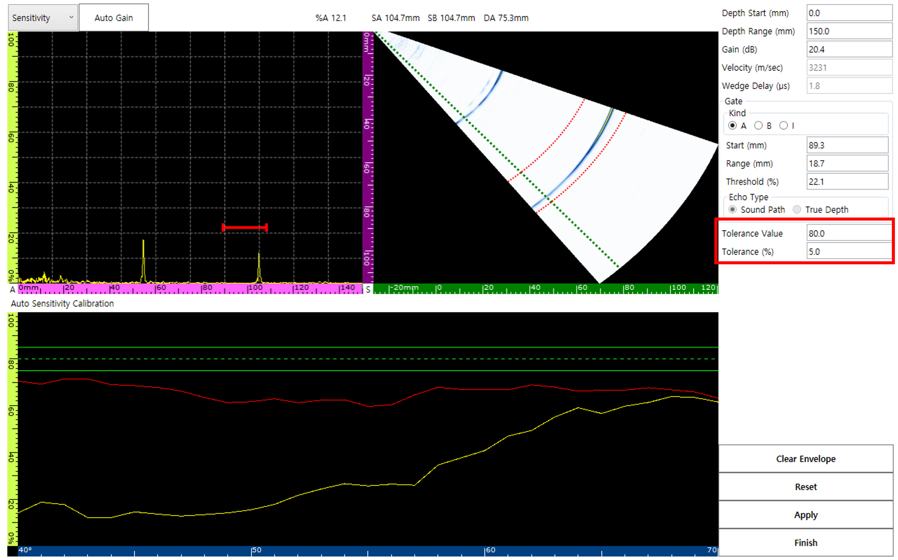
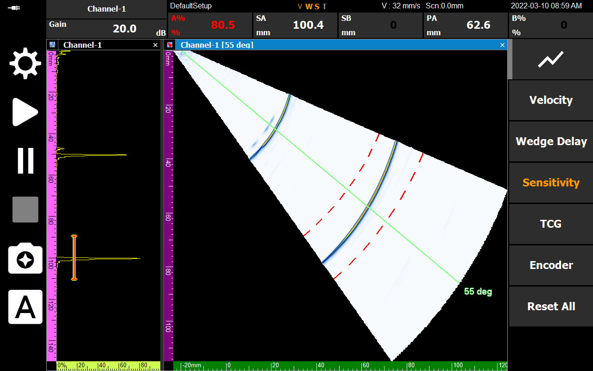

초음파 비파괴 검사에서 감도(Sensitivity)가 제대로 교정되지 않으면, 동일한 크기의 결함이라도 위치에 따라 신호 강도가 다르게 나타날 수 있습니다. 이는 결함의 심각도를 오판하게 만드는 원인이 됩니다. 이번 포스팅에서는 DEEPSOUND P5를 활용한 체계적인 감도 교정 방법을 소개합니다.

---

## 감도 교정의 중요성

감도가 교정되지 않은 상태에서는 기준 시편(예: R100)의 서로 다른 위치에서 얻은 진폭 값(Amplitude)이 일정하지 않습니다. 신호 진폭은 결함의 인지된 크기와 직접 연동되므로, 정확한 교정은 필수입니다.

---

## 교정 절차 (Calibration Procedure)

### 1. 감도 교정 페이지 진입
메뉴 순서에 따라 감도 교정(Sensitivity Calibration) 전용 페이지로 이동합니다.

### 2. 파라미터 설정
교정 페이지에서는 Depth Range, Gain, Gate 등 정밀한 조정을 위한 다양한 입력을 제공합니다.

### 3. 신호 데이터 분류
자동 감도 교정 창은 데이터를 시각적으로 명확하게 구분합니다.
- **봉락선 (Envelope):** 스캔 중 발생하는 최대 신호 궤적
- **피크 신호 (Peak Signal):** 현재 감지된 최대 신호
- **기준 및 허용 오차 (Reference & Tolerance):** 목표 진폭 값

---

## 실전 교정 팁 (Practical Tips)

전체 벡터 범위에 대한 진폭 허용 오차는 **80%**로 설정하는 것이 표준입니다.

1. **스윕(Sweep):** 최종 데이터를 캡처하기 전에 프로브를 보정 블록 위에서 천천히 움직여 봉락선(Envelope)을 형성하십시오.
2. **리셋 기능:** 데이터가 정확하지 않을 경우 **Reset** 및 **Clear Envelope**를 통해 언제든지 다시 시작할 수 있습니다.
3. **적용(Apply):** 모든 활성 벡터에 대해 허용 오차 값이 균일하게 적용되도록 합니다.

- **40도 및 55도 각도에서의 진폭 일관성 확인**

---

## 결론 (Conclusion)

교정이 성공적으로 완료되면 화면 하단의 상태 레이블 중 **'S'**가 주황색으로 활성화됩니다.

정밀한 감도 교정은 DEEPSOUND P5가 제공하는 데이터의 무결성을 보장하며, 검사자가 결함의 크기를 정량적으로 정확히 판단할 수 있는 기반이 됩니다.
