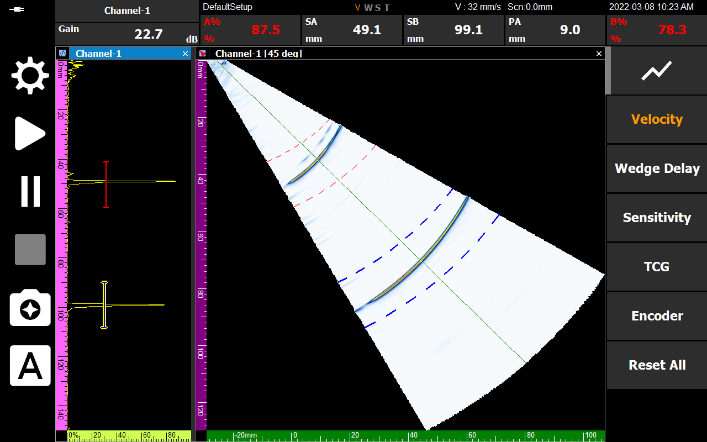
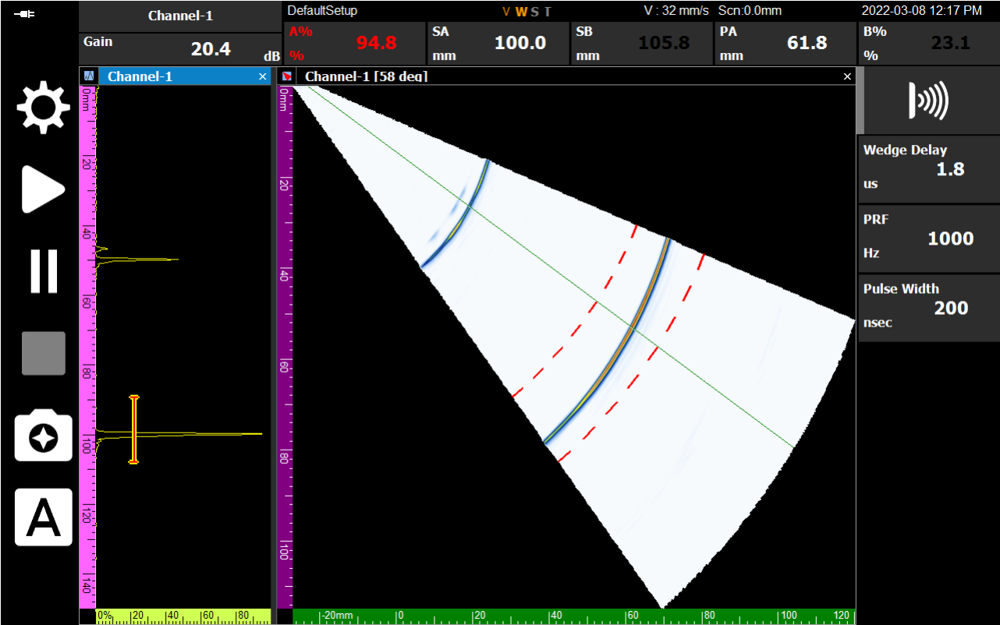

초음파가 탐촉자에서 발생하여 실제 시편에 도달하기까지, '웨지(Wedge)'를 통과하는 시간을 보정하는 과정은 매우 중요합니다. 이 과정이 생략되면 모든 결함의 좌표가 실제보다 밀려 보이게 됩니다. 이번 포스팅에서는 DEEPSOUND P5의 **자동 웨지 지연 교정** 방법을 상세히 다룹니다.

---

## 사전 필수 단계: 음속 교정

웨지 지연 교정을 수행하기 전에 반드시 **음속 교정(Velocity Calibration)**이 완료되어야 합니다. 계산된 웨지 지연값은 본질적으로 음속 수치와 연동되어 있기 때문입니다.

---

## 왜 웨지 지연 교정이 필요한가?

웨지 지연이 교정되지 않으면 시스템은 결함의 위치를 오인합니다. 예를 들어, 실제 R100(100 mm) 위치에 있는 결함을 99.1 mm로 읽는 등의 오차가 발생하게 됩니다.

---

## 자동 교정 프로세스

### 1. 교정 페이지 진입
메뉴 가이드에 따라 **Wedge Delay Calibration** 페이지로 이동합니다.

### 2. 기준값 및 게이트 설정
기준 시편의 물리적 위치(예: R100)를 바탕으로 **Ref 값을 100 mm**로 설정합니다. 동시에 A 게이트를 이동하여 신호를 포착할 수 있는 넉넉한 스캐닝 창(예: 90~110 mm)을 확보합니다.

### 3. 피크 신호 포착 (Sweep)
프로브를 수동으로 미세하게 움직여 에코(Echo)가 최대가 되는 지점을 찾습니다. 이때 화면상의 봉락선(Envelope) 신호가 기준 범위 내에 정확히 등록되어야 합니다.

### 4. 교정 적용 (Apply)
**Apply** 버튼을 클릭하면 내부 웨지 지연 수치가 즉시 업데이트됩니다. 이제 화면에 표시되는 SA 값이 정확한 100 mm를 나타내는지 확인하십시오.

---

## 완료 및 상태 확인

모든 과정을 마친 후 **Finish**를 누르면, 장비 하단의 V, W, S, T 레이블 중 **'W'**가 주황색으로 활성화됩니다. 이는 웨지 지연 교정이 성공적으로 완료되었음을 체계적으로 보여줍니다.

웨지 지연 교정은 결함 탐상의 **'영점 조절'**과 같습니다. DEEPSOUND P5의 자동 교정 기능을 활용하여 단 몇 분 만에 현장 검사의 정밀도를 극대화해 보세요.
